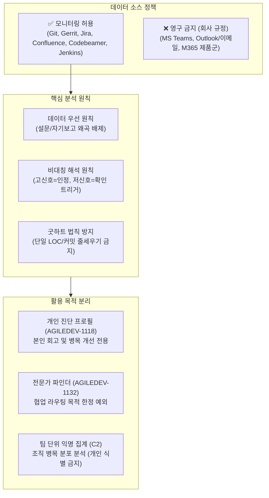
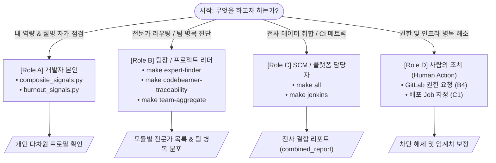
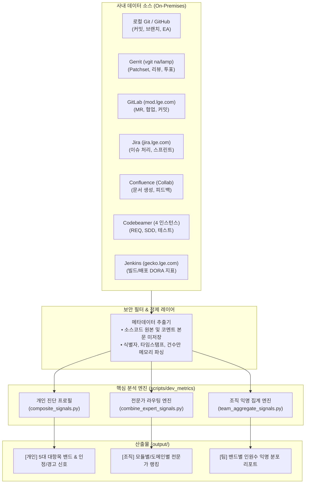
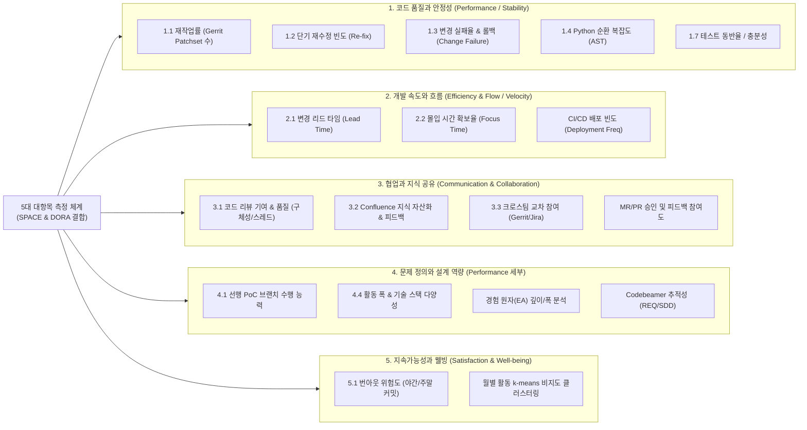
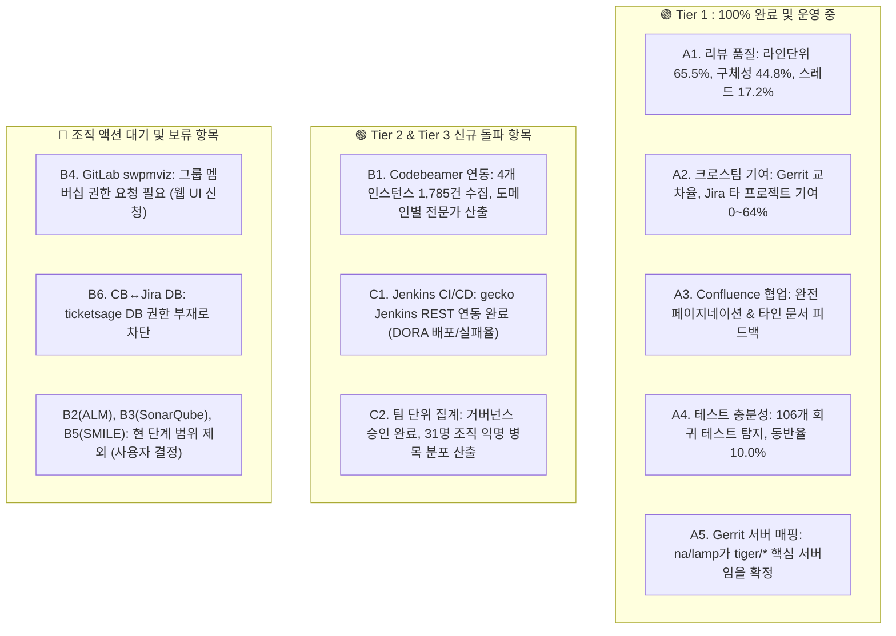
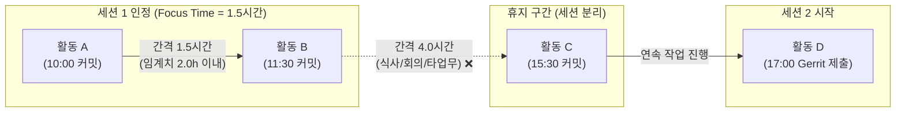
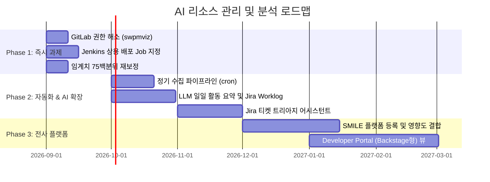

# AI 기반 리소스 관리 및 개발자 역량 분석 시스템 (AGY 통합 가이드)

> **문서 개요**: 본 문서는 `ai_resource_management` 저장소에 축적된 35개 마크다운 문서(기획서, 학술 논문 11편, 빅테크 리서치, 스펙·플랜, 실측 데이터, 액션 아이템)를 종합 분석하여 **"그래서 지금 무엇을 하면 되는가?"**에 대해 명확하고 실행 가능한 답을 제공하는 통합 실행 가이드입니다. (최대 10페이지 분량)

---

## 1. Executive Summary & 핵심 철학

### 1.1 프로젝트 존재 이유 (Why We Built This)
* **보이지 않는 업무의 가시화 (Invisible Work Visibility)**: 공식 프로젝트 외에도 GitLab(`mod.lge.com`), Gerrit, Confluence(`Collab`) 등에서 이루어지는 PoC, 사전 코드 리뷰, 기술 문서화 등 실질적 공수(MM)를 자동으로 파악합니다.
* **계획 대비 실제(Plan vs. Actual) 간극 해소**: Jira/ERP의 사전 리소스 배정 계획과 시스템 로그에 나타난 실제 투입 비중 간의 오차를 데이터 기반으로 분석합니다.
* **병목 제거 및 Focus Time(몰입 시간) 보호**: 줄세우기식 인사 평가를 배제하고, 개발자가 직면한 업무 병목을 식별하며 Focus Time을 확보하도록 돕습니다.
* **데이터 기반 질문/협업 라우팅 (Expert Finder)**: "이 모듈이나 기술 영역은 누구에게 물어봐야 하는가?"를 주관적 인상이나 정성 평가 없이 실제 시스템 기여 데이터로 찾아 연결합니다.

---

### 1.2 핵심 원칙 및 거버넌스 가드레일 (Must-Follow Rules)



1. **사내 모니터링 경계 (2026-09-09 확정)**:
   * ❌ **절대 모니터링 금지**: 이메일(Outlook), **MS Teams**, 모든 MS M365 제품군, 개인 메신저 대화, 키보드/마우스 트래킹.
   * ✅ **모니터링 허용**: Jira, Confluence 등 Atlassian 제품군, Gerrit, GitLab(`mod.lge.com`), GitHub, 로컬 Git 저장소, Codebeamer, Jenkins.
2. **데이터 우선 원칙 (Data-first Principle)**:
   * 설문·자기보고(Peer Feedback, Focus 태깅 등)는 사회적 바람직성 편향, 동일방법편향(CMB), 게이밍 유인 때문에 정식 지표 계산에서 배제하고, 순수 시스템 메타데이터만 활용합니다.
3. **굿하트의 법칙(Goodhart's Law) 방어**:
   * "측정 지표가 목표가 되는 순간 나쁜 지표가 된다." 코드 라인 수(LOC), 단순 커밋 수, 단순 패치셋 수를 단독 평가 지표로 절대 사용하지 않습니다.
4. **극단값 해석의 비대칭 원칙 (Asymmetric Interpretation)**:
   * **고신호(High Signal)**: 다차원 축에서 지속적으로 높고 품질 지표가 양호한 경우 → **인정 신호(Recognition Signal)** (보상/리텐션 참고).
   * **저신호(Low Signal)**: 활동 수치가 낮은 경우 → 역량 부족의 증거가 아니며(F=0.56, 판별 불가), 숨은 공헌이나 권한 제약일 수 있으므로 **경고 신호(Warning Sign, 매니저와의 1:1 지원·코칭 대화 트리거)** 로만 사용합니다.
5. **인사평가 직접 연동 금지**:
   * 모든 산출물은 자기 회고, 병목 진단, 협업 라우팅용이며 인사 평가나 개인 서열화에 직접 연동할 수 없습니다.

---

## 2. 역할별 실행 가이드: "그래서 지금 무엇을 하면 되는가?"

### 2.1 의사결정 및 실행 흐름도



---

### [Role A] 개발자 본인 (Self): 내 개발 패턴 및 웰빙·병목 진단
> **목적**: 5대 대항목 다차원 프로필을 통해 내 작업의 속도, 품질, 기술 다양성, 번아웃 신호를 자가 점검합니다.

* **실행 명령** (`scripts/dev_metrics` 디렉터리):
  ```bash
  cd scripts/dev_metrics

  # 1. 내 다차원 종합 프로필 및 인정/경고 신호 산출
  uv run composite_signals.py --repo ~/code/llm_wiki \
    --repos ~/code/llm_wiki ~/code/sage-wiki ~/code/pvs_crawler ~/code/ccr \
    --author "cheoljoo" --raw

  # 2. 내 활동 폭 및 경험 원자(EA: Breadth & Depth) 확인
  uv run activity_breadth.py --repos ~/code/llm_wiki ~/code/pvs_crawler --author "cheoljoo"

  # 3. 내 번아웃 신호(야간/주말 커밋 비율) 및 몰입 시간(Focus Time) 점검
  python3 burnout_signals.py --repo ~/code/llm_wiki --author "cheoljoo"
  python3 focus_time.py --repo ~/code/llm_wiki --author "cheoljoo"
  ```
* **결과 해석 요령**:
  * 대항목별 밴드(`우수 / 양호 / 관찰 필요 / 데이터 없음`) 확인.
  * 야간/주말 커밋 비율이 20%를 초과하는지 자가 점검하여 라이프 사이클 조율.
  * 테스트 코드 동반율(`test_adequacy.py`)을 확인하여 프로덕션 안정성 점검.

---

### [Role B] 팀장 / 프로젝트 리더: 전문가 탐색 및 팀 병목 익명 진단
> **목적**: 특정 기능/모듈에 대해 누구에게 도움을 청할지(라우팅) 찾고, 팀 전체의 병목 분포를 익명으로 파악합니다.

* **실행 명령**:
  ```bash
  cd scripts/dev_metrics

  # 1. 사내 Git 저장소 기반 모듈별/디렉터리별 전문가 랭킹 확인 (최근 180일 기준)
  make expert-finder SINCE_DAYS=180

  # 2. Codebeamer 트래커(요구사항/설계/테스트)별 실제 작업 전문가 확인
  make codebeamer-traceability
  cat output/codebeamer_experts_*.md

  # 3. 팀 단위 익명 병목 분포 진단 (개인 식별 없음, C2 승인 완료)
  make team-aggregate TEAM_ROSTER=team_roster.json
  ```
* **결과 활용 방법**:
  * 신규 입사자나 타 팀 협업 시 `output/expert_finder_*.txt`와 `output/codebeamer_experts_*.md`를 보고 담당자에게 리뷰나 질문 요청.
  * `team-aggregate` 결과에서 특정 대항목(예: 코드 품질, 협업)에 "관찰 필요"가 몰려 있다면 프로세스 장애(CI 지연, 문서화 부재 등) 원인을 조사하여 팀 환경 개선.

---

### [Role C] SCM / 플랫폼 담당자: 5대 소스 결합 일괄 리포트 생성
> **목적**: Git, Gerrit, GitLab, Jira, Confluence, Jenkins의 데이터를 종합 수집하여 전사 협업 메트릭을 최신화합니다.

* **실행 명령**:
  ```bash
  cd scripts/dev_metrics

  # 사전 준비: ../../.env 파일의 Jira/GitLab/Confluence 토큰 확인
  # 1. 단위 테스트 및 스크립트 무결성 검증
  make verify
  make test-gerrit test-jira-confluence test-mr-pr

  # 2. 전사 데이터 수집 및 결합 실행 (Gerrit + GitLab + Jira/Confluence + Jenkins)
  make all SINCE_DAYS=180
  make jenkins JENKINS_JOB_PATTERN="acp-master-engineering"

  # 3. 최종 결합 리포트 확인
  cat output/combined_report_*.txt
  ```

---

### [Role D] 에이전트 & 유지보수자: 사람이 처리해야 할 잔여 과제 (Human Action Checklist)
> **중요**: 시스템 코드는 완성되었으나, 사내 권한 및 조직 절차로 인해 인간 담당자가 처리해야 하는 명확한 작업 목록입니다.

| 우선순위 | 항목 | 필요 조치 내용 | 담당 주체 |
| :---: | :--- | :--- | :---: |
| 🔴 **P1** | **GitLab 권한 해소 (B4)** | `swpmviz/pvs_crawler` 프로젝트의 GitLab 웹 UI 접속 → **[Request Access]** 클릭 또는 그룹 소유자에게 Reporter 권한 요청 (`swit`은 이미 완료됨). | 사용자(사람) |
| 🟡 **P2** | **Jenkins 배포 Job 식별 (C1)** | 864개 Jenkins job 중 단순 빌드가 아닌 **실제 상용/스테이징 배포 파이프라인 job 이름 패턴**을 확정하여 `Makefile`의 `JENKINS_JOB_PATTERN`에 반영. | SCM/사용자 |
| 🟡 **P3** | **임계치 재보정 (AI Flywheel 7단계)** | `make run-history`를 실행해 제안된 75백분위 임계치(예: 재수정 비율 0.15 → 0.31)를 `composite_signals.py`에 적용 검토. | 개발자/에이전트 |
| 🟢 **P4** | **SMILE 플랫폼 등록 (B5)** | 고도화된 코드 리뷰/요구사항 추적이 필요할 시, 추후 SMILE 웹 UI(`smile.aise.lge.com`)에 "VS" 프로젝트 등록 및 SAVE API Key 연동 (현재는 범위 제외 상태). | 프로젝트 관리자 |

---

## 3. 시스템 아키텍처 및 메트릭 매핑

### 3.1 전체 데이터 수집 및 처리 아키텍처



---

### 3.2 SPACE & DORA 프레임워크 기반 5대 대항목 매핑

본 시스템은 학술적으로 검증된 **SPACE 프레임워크**와 **DORA 지표**에 사내 시스템 메타데이터를 1:1 매핑했습니다.



---

### 3.3 핵심 자동화 스크립트 맵 (`scripts/dev_metrics/`)

| 스크립트 | 대상 시스템 | 핵심 역할 | Make Target |
| :--- | :--- | :--- | :--- |
| [`composite_signals.py`](file:///home/cheoljoo.lee/code/ai_resource_management/scripts/dev_metrics/composite_signals.py) | 로컬 Git | 5대 대항목 밴드 및 인정/경고 신호 종합 산출 | `make profile` |
| [`expert_finder.py`](file:///home/cheoljoo.lee/code/ai_resource_management/scripts/dev_metrics/expert_finder.py) | 로컬 다중 Git | 모듈/디렉터리별 최근 기여자 랭킹 산출 | `make expert-finder` |
| [`combine_expert_signals.py`](file:///home/cheoljoo.lee/code/ai_resource_management/scripts/dev_metrics/combine_expert_signals.py) | 5개 소스 결합 | Git, Gerrit, GitLab, Jira, Confluence 신호 통합 리포트 | `make combine` |
| [`gerrit_signal.py`](file:///home/cheoljoo.lee/code/ai_resource_management/scripts/dev_metrics/gerrit_signal.py) | Gerrit (na/lamp) | 리뷰 투표, 인라인 코멘트, 제출자 메타데이터 수집 | `make gerrit` |
| [`gitlab_signal.py`](file:///home/cheoljoo.lee/code/ai_resource_management/scripts/dev_metrics/gitlab_signal.py) | GitLab (`mod.lge.com`) | MR 생성, 리뷰어, 승인(Approval), 커밋 수집 | `make gitlab` |
| [`jira_confluence_signal.py`](file:///home/cheoljoo.lee/code/ai_resource_management/scripts/dev_metrics/jira_confluence_signal.py) | Jira / Confluence | 로스터 인원 이슈 처리 건수, 문서 생성/편집/코멘트 수집 | `make jira-confluence` |
| [`codebeamer_traceability_signal.py`](file:///home/cheoljoo.lee/code/ai_resource_management/scripts/dev_metrics/codebeamer_traceability_signal.py) | Codebeamer | Person x Day x Tracker 추적성 및 영역별 전문가 산출 | `make codebeamer-traceability`|
| [`jenkins_signal.py`](file:///home/cheoljoo.lee/code/ai_resource_management/scripts/dev_metrics/jenkins_signal.py) | Jenkins (`gecko.lge.com`) | CI/CD 배포 빈도 및 빌드/배포 실패율 산출 | `make jenkins` |
| [`team_aggregate_signals.py`](file:///home/cheoljoo.lee/code/ai_resource_management/scripts/dev_metrics/team_aggregate_signals.py) | 로컬 다중 Git | 조직 전체 대상 5대 대항목 밴드별 인원수 익명 집계 | `make team-aggregate` |
| [`review_quality_signal.py`](file:///home/cheoljoo.lee/code/ai_resource_management/scripts/dev_metrics/review_quality_signal.py) | Gerrit | 인라인 코멘트 라인단위 비율, 스레드 비율, 구체성 판별 | `make review-quality` |
| [`test_adequacy.py`](file:///home/cheoljoo.lee/code/ai_resource_management/scripts/dev_metrics/test_adequacy.py) | 로컬 Git | 프로덕션 코드 변경 시 테스트 코드 동반율 측정 | `make test-adequacy` |
| [`monthly_activity_clusters.py`](file:///home/cheoljoo.lee/code/ai_resource_management/scripts/dev_metrics/monthly_activity_clusters.py) | 로컬 Git | 본인 활동의 월별 k-means 비지도 클러스터링(추세 판정) | `make monthly-clusters` |

---

## 4. 데이터 소스 연동 현황 및 실측 성과

현재까지 진행된 작업의 연동 상태와 실측 성과 요약입니다 (`agent-action-items.md` 기준).



1. **리뷰 품질 LLM/휴리스틱 분석 (A1 완료)**:
   * Gerrit na 서버 실측 검증: 코멘트 29건 중 라인 단위 65.5%, 스레드 형성 17.2%, 구체적 코드/식별자 언급 44.8%로 정상 분류. 개인정보 보호를 위해 본문은 저장하지 않고 판정 플래그만 집계.
2. **Codebeamer 요구사항/설계 전문가 식별 (B1 완료)**:
   * 사내 공유 계정 활용으로 20명 로스터 대상 6개월치 활동(1,785건) 수집 성공.
   * `RouteManager`, `AntennaManager`, `TimeManager`, `cTelltaleHmi` 등 주요 모듈별 핵심 전문가 명단 도출 (`output/codebeamer_experts_2026-09-21.md`).
3. **Jenkins CI/CD 연동 (C1 PoC 완료)**:
   * webOS SCM CI/CD 인프라(`gecko.lge.com/jenkins`) 연동 성공. 배포 빈도 및 빌드 실패율을 프로젝트 단위로 집계 가능.
4. **팀 단위 익명 집계 (C2 완료)**:
   * 거버넌스 승인 하에 31명 규모 조직 실행 완료. 코드 품질 대항목(양호 8명, 관찰 필요 23명), 개발 속도(우수 31명), 문제정의/설계(양호 18명, 우수 13명) 등 개인 식별 없이 조직 전반의 건강도 분포 파악.

---

## 5. 핵심 분석 방법론 및 학술적 배경

### 5.1 사후 시간 추정의 한계와 극복 기법 (From-To Approximation)
시스템 로그(Git 커밋, Gerrit 제출, Confluence 저장)는 모두 **작업이 끝난 시점(Point-in-Time, To)**의 데이터이며, **작업 시작 시각(From)**을 알 수 없습니다. 이를 극복하기 위해 본 시스템은 **이벤트 간격(Inter-Event Gap) 기반 세션 클러스터링**을 적용합니다.



1. **이벤트 간격(Inter-Event Gap) 휴리스틱**: 동일 사용자의 연속된 커밋/활동 간격이 임계값(기본 2시간) 이내면 하나의 연속 몰입 세션으로 합산 (`focus_time.py`).
2. **Jira 상태 전이(In Progress → Done)**: 시작 버튼과 완료 버튼 시점을 명확한 From-To 쌍으로 활용.
3. **브랜치 생애주기 (Branch Lifecycle)**: Feature 브랜치 생성 시점부터 PR 병합 시점까지를 해당 태스크 시간의 상한선으로 정의.
4. **자기 선언형 하이브리드 보정**: 사용자의 자발적 Focus 세션 기록을 기반으로 개인별 간격 임계값을 동적으로 보정.

---

### 5.2 학술 논문 11편 및 빅테크 사례 핵심 시사점

| 연구/사례 | 핵심 내용 및 실증 결과 | 본 프로젝트 적용 방식 |
| :--- | :--- | :--- |
| **SPACE (2021)** | 생산성은 만족도·성과·활동·협업·효율성 5차원으로 측정해야 하며 단일 지표는 위험. | 5대 대항목 구조 채택 및 최소 3개 대항목 충족 시에만 리포트 발행. |
| **DORA / Accelerate** | 배포빈도, 리드타임, 변경실패율, 복구시간 4대 지표. 속도와 품질은 상충하지 않음. | Jenkins 및 Git 리드타임 수집기에 직접 도입. |
| **Montandon et al. (2019)** | 고활동 클러스터는 전문가와 65~75% 일치하나, 저활동은 판별 불능(F=0.56). | **극단값 비대칭 해석 원칙**: 고신호는 인정, 저신호는 코칭 트리거로만 사용. |
| **Mockus & Herbsleb (2002)** | 형상관리 변경 이력만으로 **경험 원자(EA)**를 정의해 전문성 자동 식별. | `experience_atoms.py` 구현, 전문성의 폭(Breadth)과 깊이(Depth) 구분. |
| **Podsakoff et al. (2003)** | 자기보고 설문 시 공통방법편향(CMB) 및 왜곡 발생 실증. | 설문·자기보고 배제, 시스템 메타데이터 우선 원칙 채택. |
| **Google / Spotify** | 개인 순위화 배제, 팀 건강도(Squad Health Check) 및 병목 개선 중심 문화. | 인사평가 연동 영구 금지 및 팀 단위 익명 집계 설계. |

---

## 6. 향후 로드맵 (Next Steps)



1. **Phase 1: 즉시 실행 (현재 병목 해결)**
   * 사람이 GitLab 웹 UI에서 `swpmviz` 그룹 멤버십 권한을 신청하여 404 차단 해제.
   * Jenkins 864개 Job 중 실제 운영/스테이징 배포 파이프라인 패턴 확정.
   * `run_history.py`를 기반으로 실측 데이터 임계값 보정.
2. **Phase 2: 자동화 및 LLM 결합 (PwC Flywheel 3~5단계 확장)**
   * `cron` 또는 CI 기반 정기 스케줄러 구축으로 상시 데이터 갱신.
   * 하루 활동 메타데이터를 LLM이 자동 요약하여 Jira 댓글/Worklog에 제안하는 워크플로 구현.
   * Jira 티켓 자동 분류 및 중복 탐지 어시스턴트(트리아지) 도입.
3. **Phase 3: 플랫폼 고도화**
   * 사내 AI 코드 영향도 분석 플랫폼(SMILE)에 공식 프로젝트 등록 후 심층 코드 리뷰 및 REQ/SDD 추적성 지표 결합.
   * Backstage 형태의 내부 엔지니어링 포털과 연동하여 팀 단위 가시성 극대화.

---

## 부록: 저장소 내 35개 마크다운 문서 인덱스 및 분류

본 저장소의 모든 `.md` 문서는 목적에 따라 다음과 같이 분류되어 있습니다.

```
ai_resource_management/
├── 1. 기획 및 종합 가이드
│   ├── README_agy.md                       : 본 통합 안내서 (모든 문서의 종합 요약 및 액션 플랜)
│   ├── README.md                           : 초기 프로젝트 정의
│   ├── resource_mgmt.md                    : 사내 인프라 맞춤형 AI 리소스 관리 방안 (아키텍처, From-To)
│   ├── developer_evaluation_metrics.md     : 개발자 역량/성과 측정 프레임워크 (5대 대항목, 거버넌스)
│   ├── dev_metrics_code_map.md             : 메트릭 스크립트 매핑 및 브랜치별 작업 요약
│   ├── agent-action-items.md               : 데이터 확보 Action Items (Tier 1~3 최신 결과)
│   ├── gerrit_diff.md                      : Gerrit diff hunk 헤더 파싱 기반 Re-fix 탐지 설계
│   └── worklog_brief.md                    : 자동 Worklog 시스템 설계 및 백스테이지/글로벌 사례 요약
│
├── 2. 실측 리포트 및 업무 기록
│   ├── charles_worklog_2026.md             : 2026년 업무 기록 및 Worklog 수집/추정 시스템 상세
│   ├── self_performance_report_2026-08.md : 본인(cheoljoo.lee) 실측 데이터 검증 리포트
│   ├── scripts/dev_metrics/output/codebeamer_experts_2026-09-21.md     : Codebeamer 영역별 전문가
│   └── scripts/dev_metrics/output/codebeamer_traceability_2026-09-21.md : Codebeamer 추적성 집계
│
├── 3. 수집기 실행 가이드 (scripts/dev_metrics/)
│   ├── scripts/dev_metrics/gerrit_signal.md          : Gerrit 리뷰/투표/코멘트 수집기 가이드
│   ├── scripts/dev_metrics/jira_confluence_signal.md : Jira/Confluence REST API 수집기 가이드
│   └── scripts/dev_metrics/mr_pr_signal.md           : GitLab MR 및 GitHub PR 수집기 가이드
│
├── 4. AGILEDEV-1118: 개인 진단 프로필 (intents/2026-09-09-developer-expertise-grading/)
│   ├── intent.md / spec.md / plan.md                 : 개인 진단 프로필 기획/스펙/실행계획
│   ├── research/company-practices.md                 : 빅테크 4사(Google, Spotify, Uber, LinkedIn) 분석
│   ├── research/pwc-genai-flywheel.md                : PwC GenAI 플라이휠 8단계 적용 진단
│   ├── research/usecase-portfolio-comparison.md      : 유스케이스 우선순위 비교 분석
│   └── research/papers/ (학술 논문 11편 요약)
│       ├── README.md                                 : 논문 11편 인덱스 및 공통 시사점
│       ├── space-framework.md                        : SPACE 프레임워크 (2021)
│       ├── accelerate-dora.md                        : DORA DevOps 연구 (2018)
│       ├── devex-productivity.md                     : DevEx 프레임워크 (2023)
│       ├── meyer-perceptions-of-productivity.md      : 개발자의 생산성 인식 연구 (2014)
│       ├── mockus-herbsleb-expertise-browser.md      : 경험 원자(EA) 기반 전문성 브라우저 (2002)
│       ├── montandon-identifying-experts-github.md    : 전문가 식별의 비대칭적 신뢰도 (2019)
│       ├── sadowski-modern-code-review.md            : Google 코드 리뷰 케이스 스터디 (2018)
│       ├── murphy-hill-what-predicts-productivity.md : 생산성 예측 요인 분석 (2021)
│       ├── vasilescu-ci-github.md                    : CI 도입 효과 연구 (2015)
│       ├── podsakoff-common-method-bias.md           : 공통방법편향(CMB) 이론 (2003)
│       └── ghazi-survey-research-se-problems-strategies.md : SE 설문 연구 문제점과 전략 (2017)
│
└── 5. AGILEDEV-1132: 전문가 파인더 (intents/2026-09-11-expert-finder/)
    ├── intent.md                                     : 전문가 파인더 의도 정의
    ├── spec.md                                       : 전문가 파인더 스펙 및 5대 소스 결합
    └── plan.md                                       : 전문가 파인더 구현 계획
```
