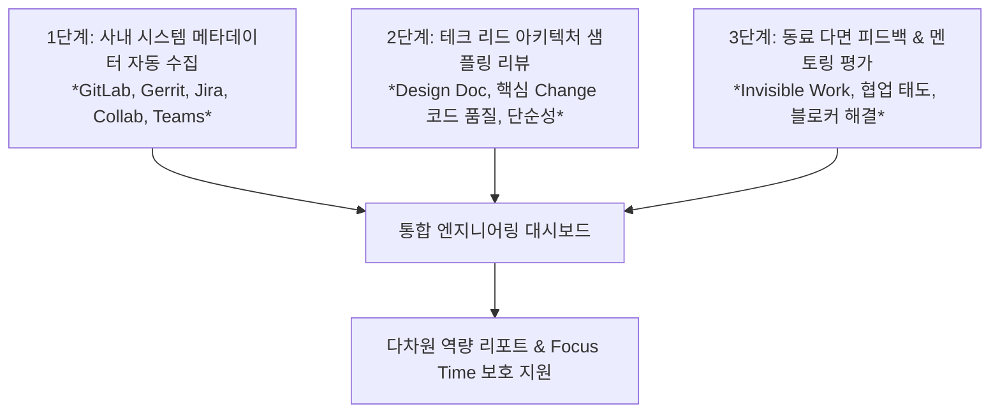

# 개발자 업무 역량 및 성과 측정 프레임워크 (시스템 메타데이터 연계 분석)

본 문서는 개발자의 업무 역량, 생산성, 기여도를 객관적이고 지속 가능하게 파악하기 위한 평가 프레임워크를 정의합니다. 사내 인프라(**GitLab/mod.lge.com, Gerrit, Confluence/Collab, Jira, MS Teams**)에서 수집 가능한 **시스템 메타데이터(System Metadata)**를 활용하여 자동 분석이 가능한 영역과 불가능한 영역을 분류하고, 자동 측정이 어려운 영역에 대한 구체적인 보완 대안을 제시합니다.

---

## 1. 개요 및 핵심 원칙

### 1.1 기본 측정 철학 (SPACE & DORA 기반)
* **다차원 복합 측정**: 단순한 코드 생산량(Activity)에 치우치지 않고, 글로벌 표준인 **SPACE 프레임워크**(만족도, 성과, 활동, 협업, 효율성) 및 **DORA 지표**(리드타임, 배포빈도, 실패율, 복구시간)를 결합하여 다면적으로 평가합니다.
* **지원(Support) 중심 포지셔닝**: 감시나 줄세우기식 인사 평가가 아닌, 개발자의 병목(Blocker)을 해소하고 **Focus Time(몰입 시간)을 보호**하기 위한 진단 도구로 활용합니다.

### 1.2 굿하트의 법칙(Goodhart's Law) 및 안티패턴 방지
> [!WARNING]
> **"측정 지표가 목표가 되는 순간, 그 지표는 더 이상 좋은 지표가 되지 못한다."**
> 단일 정량 지표(코드 라인 수, 단순 커밋 수 등)를 절대적 평가 기준으로 삼으면 왜곡된 엔지니어링 행동(Gaming the system)을 초래합니다.

| 절대 단독 평가 지표로 쓰면 안 되는 항목 | 발생하는 왜곡 및 부작용 |
| :--- | :--- |
| **코드 라인 수 (LOC, Lines of Code)** | 불필요하게 장황한 코드 작성, 라이브러리 복사-붙여넣기 유발 |
| **단순 커밋 수 / PR(Gerrit Change) 수** | 무의미한 커밋 쪼개기, 단순 오타 수정 위주의 작업 양산 |
| **근무 시간 / 키보드·마우스 활동량** | 화면 켜두기 등 형식적 체류, 극심한 반발 및 번아웃 유발 |
| **단순 버그 수정 건수** | 아키텍처 개선 등 어렵고 근본적인 작업 기피, 쉬운 버그만 선별 처리 |

---

## 2. 5대 대항목별 소항목 메타데이터 분석 가능 여부 및 대안

> **분류 기준**:
> * `[O] 자동 수집/분석 가능`: 사내 도구(GitLab, Gerrit, Jira, Confluence, Teams)의 로그/메타데이터로 정량화 가능.
> * `[△] 부분 가능 / 조건부 가능`: 메타데이터로 신호는 포착되나, 의미론적 분석(LLM/휴리스틱)이나 정성적 검증이 병행되어야 함.
> * `[X] 자동 수집 불가`: 시스템 로그만으로는 판단할 수 없으며, 동료 평가(Peer Review)나 전문가 리뷰가 필수적임.
>
> **Claude 직접 수집 가능 여부** (이번 검토에서 추가한 표시 — 위 분류와는 별개로, *지금 이 Claude Code 세션이 MCP 연결이나 직접 작성한 코드로 바로 값을 얻어올 수 있는지*를 나타냄):
> * `✅ 즉시 가능`: 로컬 git 저장소 데이터(커밋 타임스탬프, diff, 브랜치/리비전 이력)만으로 Bash에서 `git log` 등을 직접 실행해 산출 가능. 별도 사내 시스템 접근 불필요.
> * `🔑 API 필요`: Gerrit/GitLab/Jira/Confluence/Teams REST API 엔드포인트와 인증 토큰이 주어지면 스크립트로 가능하지만, 현재 세션에는 해당 사내(mod.lge.com) 시스템에 연결된 MCP가 없어 지금 당장은 값을 가져올 수 없음.
> * `❌ 불가`: 정성적 판단 영역이라 MCP나 코드로는 애초에 산출 불가 (문서의 `[X]`와 동일).
> * `⏭️ 범위 제외`: 사용자 결정으로 이번 검토에서 다루지 않음 (Teams 관련 항목 — M365 커넥터 미설치 확인, 사내 privacy/거버넌스 정책 미확인 상태).

---

### 대항목 1. 코드 품질 및 완성도 (Quality & Reliability)

#### 1.1 재작업률 (Rework Rate / Patchset 수)
* **측정 가능 여부**: `[O] 자동 수집 가능`
* **Claude 직접 수집 가능 여부**: `🔑 API 필요` — Gerrit REST 엔드포인트/토큰이 있으면 코드로 바로 가능하나, 현재 세션엔 Gerrit MCP가 연결되어 있지 않음.
* **사용 데이터 소스**: Gerrit REST API (`PATCHSET_ADDED` 이벤트, Change별 Patchset 개수)
* **메타데이터 분석 방식**:
  * 단일 Change ID당 발생한 Patchset 개수 집계.
  * 평균 Patchset 수가 지나치게 높다면(예: 7회 이상) 초기 구현 완성도 부족 또는 리뷰 피드백 수용 비효율로 해석.
* **보완/주의점**: 아키텍처 논의가 필요한 대규모 Feature Change는 자연스럽게 Patchset이 많아질 수 있으므로 변경 라인 수(Diff Size)와 결합하여 정규화 필요.

#### 1.2 단기 재수정 (Re-fix) 빈도
* **측정 가능 여부**: `[O] 자동 수집 가능`
* **Claude 직접 수집 가능 여부**: `✅ 즉시 가능 (부분)` — 로컬 git 저장소라면 `git log -p --follow`로 파일/함수 영역별 재수정 이력을 직접 분석 가능. 다만 Gerrit의 Change/Patchset 단위 메타데이터까지 반영하려면 Gerrit API가 추가로 필요.
* **사용 데이터 소스**: Gerrit Diff Patch Hunk 파싱 (`file_path`, `function_name`, `merged_at`)
* **메타데이터 분석 방식**:
  * 특정 함수/모듈이 Merge된 후 30~90일 이내에 동일 영역이 다시 수정(Fix)되는 패턴을 SQL Window 함수로 탐지.
* **보완/주의점**: 기능 확장에 의한 정상적 수정과 버그 수정을 구분하기 위해 커밋 메시지 키워드(`fix`, `bug`, `issue` 등) 및 Jira 버그 티켓 태깅 여부 교차 검증.

#### 1.3 변경 실패율 (Change Failure Rate / Hotfix, Rollback)
* **측정 가능 여부**: `[△] 부분 가능`
* **Claude 직접 수집 가능 여부**: `🔑 API 필요 (부분)` — `git log --grep`, `git revert` 이력, `hotfix/`·`revert-` 브랜치명 탐지는 로컬 git으로 바로 가능(✅). 다만 Jira 장애 티켓과의 교차 검증은 Jira API 연결이 필요.
* **사용 데이터 소스**: GitLab 브랜치/태그 이력, Gerrit Revert Change, Jira 배포/장애 티켓
* **자동화 한계 및 불가 이유**:
  * 단순히 브랜치/Gerrit 로그만으로는 특정 커밋이 장애를 유발해 Revert된 것인지, 기획 변경으로 롤백된 것인지 구분하기 어려움.
* **보완 대안**:
  * Gerrit의 `Revert` 액션 및 브랜치 내 `hotfix/`, `revert-` 접두사 태깅 자동 감지.
  * 사내 장애 관리 시스템/Jira Post-mortem 티켓과 Merge 이력(Change-Id) 연동.

#### 1.4 복잡도 대비 결함 밀도 (Defect Density vs. Complexity)
* **측정 가능 여부**: `[△] 부분 가능`
* **Claude 직접 수집 가능 여부**: `🔑 API 필요` — SonarQube 서버 API가 연결되면 코드로 가능. 단, Claude가 직접 소스에 대해 정적분석 도구(예: `radon`, `lizard` 등)를 실행해 순환 복잡도만 별도 산출하는 것은 ✅ 즉시 가능.
* **사용 데이터 소스**: SonarQube 정적 분석 메타데이터 (Cyclomatic Complexity), Jira 버그 티켓
* **자동화 한계 및 불가 이유**:
  * 코드의 줄 수나 순환 복잡도(Complexity) 대비 결함 수는 정적 분석 툴로 산출할 수 있으나, 레거시 시스템 의존성이나 비즈니스 도메인의 본질적 난이도를 온전히 반영하지 못함.
* **보완 대안**:
  * SonarQube/SonarGitLab의 정적 분석 결과(기술 부채, 취약점 지표)를 CI 단계에서 메타데이터로 연계 수집하여 참조 지표로 활용.

---

### 대항목 2. 개발 속도와 흐름 (Velocity & Flow)

#### 2.1 변경 리드 타임 (Lead Time for Changes)
* **측정 가능 여부**: `[O] 자동 수집 가능`
* **Claude 직접 수집 가능 여부**: `✅ 즉시 가능 (부분)` — 로컬 git의 최초 커밋~병합 커밋 타임스탬프 차이는 `git log`로 바로 계산 가능. Gerrit First Upload 시각처럼 Gerrit 서버에만 있는 값은 Gerrit API 필요(🔑).
* **사용 데이터 소스**: GitLab 브랜치/MR 생성 시점, Gerrit First Upload ~ Final Submit 시각
* **메타데이터 분석 방식**:
  * `mod.lge.com` Feature 브랜치 최초 커밋 시점부터 Gerrit Merge 완료까지의 소요 시간을 자동 계산 (Pre-Gerrit to Gerrit Transition Time).
* **보완/주의점**: 외부 의존성(기획 대기, 타 부서 API 미완료)으로 인한 지연 여부를 감안하기 위해 리뷰 대기 시간과 실제 작업 시간을 분리 집계.

#### 2.2 몰입 시간 확보율 (Focus Time)
* **측정 가능 여부**: `[△] 부분 가능 (하이브리드 추정)`
* **Claude 직접 수집 가능 여부**: `✅ 즉시 가능 (Git 부분만) / ⏭️ Teams 항목은 범위 제외` — 커밋 타임스탬프 기반 Inter-Event Gap 분석은 로컬 git으로 즉시 가능. Teams 캘린더 연동(Inverse Calendar Block)은 사용자 결정에 따라 이번 검토 범위에서 제외(사내 M365/Teams 커넥터 미설치 확인됨, 정책 확인도 보류).
* **사용 데이터 소스**: MS Teams 캘린더 (Meeting Hours), GitLab/Gerrit 커밋 타임스탬프 세션
* **자동화 한계 및 불가 이유**:
  * 로그는 '발생 시점(Point-in-Time)'일 뿐, 화면 앞에서 실제로 얼마나 집중했는지(From-To)는 직접 측정 불가.
* **보완 대안**:
  * **Inter-Event Gap 휴리스틱**: 2시간 이내 연속 커밋/활동을 하나의 Focus 세션으로 묶음.
  * **Inverse Calendar Block**: Teams 캘린더상 회의가 없는 2시간 이상의 빈 블록을 Focus 가능 구간으로 산출.
  * **자기 선언형(Self-Report) 인터페이스**: Teams Copilot을 통해 Focus 모드 선언 및 보정(Calibration) 데이터 확보.

#### 2.3 진행 중 작업 (WIP, Work In Progress) 관리
* **측정 가능 여부**: `[O] 자동 수집 가능`
* **Claude 직접 수집 가능 여부**: `🔑 API 필요` — Jira/Gerrit REST API 연결이 필요. 참고로 이 세션에는 `mcp__claude_ai_Atlassian_Rovo` 인증 도구가 있으나 이는 사내 `mod.lge.com` Jira가 아닌 클라우드 Atlassian 계정 연동용이라 별도 확인 필요.
* **사용 데이터 소스**: Jira 상태(`In Progress` 티켓 수), Gerrit 미완료 Open Change 수
* **메타데이터 분석 방식**:
  * 한 개발자에게 동시에 `In Progress`로 열려 있는 Jira 티켓 수 및 병렬 검토 중인 Gerrit Open Change 수를 일자별로 트래킹.
  * 동시 다발적 진행(WIP > 3~4건) 시 컨텍스트 스위칭 오버헤드로 판정.

---

### 대항목 3. 협업 및 팀 기여도 (Collaboration & Citizenship)

#### 3.1 코드 리뷰 기여도 (Review Quality & Turnaround Time)
* **측정 가능 여부**: `[△] 부분 가능`
* **Claude 직접 수집 가능 여부**: `🔑 API 필요 (수집) / ✅ 즉시 가능 (분석)` — 리뷰 코멘트 원문 자체는 Gerrit API로 가져와야 하지만(🔑), 일단 텍스트만 확보되면 "단순 동의 vs 구조적 제안" 같은 LLM 시맨틱 분류는 Claude가 지금 바로 수행 가능.
* **사용 데이터 소스**: Gerrit REST API (Reviewer 할당, `COMMENT`, `VOTE` 타임스탬프, 코멘트 길이)
* **자동화 한계 및 불가 이유**:
  * 리뷰 응답 속도(Turnaround Time)와 리뷰 참여 횟수는 완벽히 측정 가능하나, 작성된 코멘트가 단순한 `LGTM(+1)`인지 아키텍처적 조언인지 정량 수치만으로는 판별 불가.
* **보완 대안**:
  * **정량 지표**: 리뷰 요청 수신 후 첫 피드백까지의 시간(평균 응답 속도), 리뷰한 Change 개수.
  * **LLM 시맨틱 분석**: 리뷰 코멘트 본문을 LLM(온프레미스)으로 분석하여 '단순 동의' vs '구조적 제안/결함 지적'을 분류하고 가중치 부여.

#### 3.2 지식 자산화 및 문서화 (Documentation)
* **측정 가능 여부**: `[O] 자동 수집 가능`
* **Claude 직접 수집 가능 여부**: `🔑 API 필요` — 사내 Confluence/Collab에 연결된 MCP가 없어 지금은 불가. (참고: `claude.ai Notion` MCP는 연결되어 있으나 사내 Collab과는 별개 시스템.)
* **사용 데이터 소스**: Confluence/Collab REST API (신규 페이지 생성, 문서 편집, 테크 위키 기여)
* **메타데이터 분석 방식**:
  * 작성자 ID 기준 신규 기술 문서 생성 수, 주요 기술 페이지 업데이트 이력 집계.
  * 소스 코드 개발(GitLab/Gerrit) 대비 Collab 기술 문서 산출 비율(Collab 지식 자산화율) 산출.

#### 3.3 블로커 해결 및 동료 멘토링 (Invisible Work / Support)
* **측정 가능 여부**: `[X] 자동 수집 불가`
* **Claude 직접 수집 가능 여부**: `❌ 불가`
* **사용 데이터 소스**: 없음 (Teams DM 및 구두 대화는 개인정보/보안상 수집 배제)
* **자동화 한계 및 불가 이유**:
  * 동료 자리로 가서 도와주거나, 1:1 통화/페어 프로그래밍을 통해 문제를 해결해 준 내역은 메타데이터 로그에 남지 않음.
* **보완 대안**:
  * **Peer Feedback (동료 다면 평가)**: 분기/반기별 "업무상 가장 큰 기술적 도움을 준 동료" 추천 제도 운영.
  * **Spot Kudos (칭찬/감사 채널)**: Teams 팀 채널 내 도움을 주고받은 내역을 자발적으로 태깅(`@thanks_bot`).

---

### 대항목 4. 문제 정의 및 설계 역량 (Problem Solving & Complexity)

#### 4.1 선행 검증 및 PoC 수행 능력
* **측정 가능 여부**: `[O] 자동 수집 가능`
* **Claude 직접 수집 가능 여부**: `✅ 즉시 가능 (부분)` — 로컬 git의 브랜치 목록/생성 이력(`git branch`, `git log --all`)은 바로 조회 가능. Collab POC 보고서 존재 여부는 Confluence API 필요(🔑).
* **사용 데이터 소스**: GitLab(`mod.lge.com`) POC 저장소/브랜치 생성 이력, Collab POC 보고서
* **메타데이터 분석 방식**:
  * 정식 Gerrit 서브밋 이전 선행 POC 저장소에서의 사전 검증 커밋 및 Collab 기술 검증 보고서 작성 빈도 추출.

#### 4.2 요구사항 분석 및 설계 명확성
* **측정 가능 여부**: `[X] 자동 수집 불가`
* **Claude 직접 수집 가능 여부**: `❌ 불가`
* **사용 데이터 소스**: 없음 (정성적 영역)
* **자동화 한계 및 불가 이유**:
  * 기획이나 스펙의 모호한 점을 사전에 발견해 기획자/고객과 조율한 행동은 시스템 로그로 정량화할 수 없음.
* **보완 대안**:
  * **Design Doc / RFC 리뷰 프로세스**: 개발 착수 전 작성하는 아키텍처 설계 문서(Design Doc)에 대한 테크 리드 및 시니어 엔지니어의 사전 리뷰 평가.

#### 4.3 오버엔지니어링 지양 (Simplicity)
* **측정 가능 여부**: `[X] 자동 수집 불가`
* **Claude 직접 수집 가능 여부**: `❌ 불가 (판단 자체는 정성적)` — 다만 특정 Change/PR 코드에 대해 "이 패턴이 과도한지"를 리뷰하는 것 자체는 Claude가 `/code-review`로 정성 분석을 보조할 수 있음(측정 지표화는 여전히 불가).
* **사용 데이터 소스**: 없음 (정성적 영역)
* **자동화 한계 및 불가 이유**:
  * 도입된 디자인 패턴이나 라이브러리가 당면 과제에 비해 과도한지(Over-engineering) 적절한지는 오직 도메인을 이해하는 전문가의 코드 리뷰로만 판단 가능.
* **보완 대안**:
  * **Architecture Review (샘플링 코드 리뷰)**: 주기적으로 대표 Merge Change를 선정하여 아키텍처 단순성 및 유지보수성을 테크 리드가 정성 평가.

---

### 대항목 5. 지속 가능성 및 웰빙 (Sustainability & Well-being)

#### 5.1 번아웃 위험도 (Burnout Signals)
* **측정 가능 여부**: `[O] 자동 수집 가능`
* **Claude 직접 수집 가능 여부**: `✅ 즉시 가능 (Git 부분만) / ⏭️ Teams 항목은 범위 제외` — 야간/주말 커밋 빈도는 `git log --date=iso`로 바로 집계 가능. Teams 회의 시간 합산은 사용자 결정에 따라 이번 검토 범위에서 제외.
* **사용 데이터 소스**: GitLab/Gerrit 타임스탬프 (야간/주말 활동), Teams 캘린더 미팅 시간
* **메타데이터 분석 방식**:
  * 정규 근무시간 외(오후 9시 이후 또는 주말) 커밋/Gerrit 업로드 빈도 트렌드 추적.
  * 주당 총 회의 시간이 15~20시간을 초과하여 코딩 시간이 잠식되는지 여부 자동 산출.
* **보완/주의점**: 개인의 자율 근무 패턴(유연근무제)일 수 있으므로 평가가 아닌 웰빙 케어 알림(Copilot Notification) 용도로만 사용.

#### 5.2 주도적 개선 태도 (Post-mortem & Feedback Culture)
* **측정 가능 여부**: `[△] 부분 가능`
* **Claude 직접 수집 가능 여부**: `🔑 API 필요` — Collab/Jira 모두 사내 시스템이라 연결된 MCP가 없어 지금은 불가. API/토큰이 주어지면 스크립트로 문서 존재 여부와 티켓 완결율 조회는 가능.
* **사용 데이터 소스**: Collab 회고(Post-mortem) 문서, Jira 회고 액션 아이템 티켓
* **자동화 한계 및 불가 이유**:
  * 회고 문서의 존재 여부는 수집 가능하나, 실패를 통해 실질적인 재발 방지책을 실행했는지는 정성적 판단 필요.
* **보완 대안**:
  * 장애 발생 후 Collab 사후 분석서(Post-mortem) 작성 여부 및 후속 개선 티켓 완결율을 연결하여 확인.

---

## 3. 시스템 메타데이터 실현 가능성 종합 매트릭스 (Summary Matrix)

| 대항목 | 세부 소항목 | 자동화 가능 여부 | Claude 직접 수집 가능 여부 | 주요 데이터 소스 | 불가 이유 및 한계 | 권장 보완 대안 |
| :--- | :--- | :---: | :---: | :--- | :--- | :--- |
| **1. 품질 & 완성도** | 1.1 재작업률 (Patchset 수) | **[O]** | 🔑 API 필요 | Gerrit REST API | - | Diff 크기(Line 수)와 가중치 연계 |
| | 1.2 단기 재수정 (Re-fix) 빈도 | **[O]** | ✅ 즉시 가능(부분) | Gerrit Diff Hunk Header | 단순 기능 확장과 오인 가능 | 커밋 메시지(Fix/Bug) 및 Jira 연동 |
| | 1.3 변경 실패율 (Hotfix/Revert) | **[△]** | 🔑 API 필요(부분 ✅) | Gerrit Revert, GitLab Tag | 기획 변경에 의한 롤백과 혼재 | Jira 장애 티켓 및 Revert 사유 매핑 |
| | 1.4 복잡도 대비 결함 밀도 | **[△]** | 🔑 API 필요(부분 ✅) | SonarQube, Jira Bugs | 본질적 도메인 난이도 반영 한계 | 정적 분석 지표를 CI 파이프라인 연계 |
| **2. 속도 & 흐름** | 2.1 변경 리드 타임 | **[O]** | ✅ 즉시 가능(부분) | GitLab, Gerrit Submit | 외부 병목(타팀 대기) 구분 필요 | 순수 리뷰 대기 시간 분리 산출 |
| | 2.2 몰입 시간 확보율 (Focus) | **[△]** | ✅ Git 부분만 / ⏭️ Teams 제외 | Teams Calendar, Git Session | Point-in-Time 로그의 한계 | Inter-Event Gap + 자기선언형 보정 |
| | 2.3 진행 중 작업 (WIP) 관리 | **[O]** | 🔑 API 필요 | Jira `In Progress`, Open Changes | - | 동시 작업 3건 초과 시 알림 |
| **3. 협업 & 기여도** | 3.1 코드 리뷰 기여도 | **[△]** | 🔑 수집 필요 / ✅ 분석 가능 | Gerrit Comments/Votes | 단순 승인(+1)과 실질 조언 구분 불가 | 리뷰 응답속도 + LLM 코멘트 분석 |
| | 3.2 지식 자산화 (문서화) | **[O]** | 🔑 API 필요 | Confluence/Collab API | - | 코드 대비 기술 문서 생성 비율 산출 |
| | 3.3 블로커 해결 & 멘토링 | **[X]** | ❌ 불가 | 없음 (수집 대상 제외) | 구두 지원 및 DM 등 비가시적 소통 | Peer 360 다면 평가, Kudos 채널 |
| **4. 문제정의 & 설계** | 4.1 선행 PoC 수행 능력 | **[O]** | ✅ 즉시 가능(부분) | GitLab POC Repos, Collab | - | 정식 서브밋 전 선행 검증 이력 집계 |
| | 4.2 요구사항 분석 & 설계 | **[X]** | ❌ 불가 | 없음 (정성적 영역) | 초기 기획 조율 행동은 로그 부재 | Design Doc / RFC 사전 리뷰 프로세스 |
| | 4.3 오버엔지니어링 지양 | **[X]** | ❌ 불가 | 없음 (정성적 영역) | 기술 스택 적합성은 전문가 판단 영역 | 테크 리드의 샘플링 아키텍처 리뷰 |
| **5. 지속성 & 웰빙** | 5.1 번아웃 위험도 (야간/회의) | **[O]** | ✅ Git 부분만 / ⏭️ Teams 제외 | Git Timestamps, Teams Cal | 유연근무제에 따른 개인차 존재 | 웰빙 케어 알림(Support)으로만 활용 |
| **5. 지속성 & 웰빙** | 5.2 주도적 개선 (Post-mortem) | **[△]** | 🔑 API 필요 | Collab Post-mortem, Jira | 문서 존재만으로 실행력 담보 불가 | 장애 후속 개선 티켓 완결율 추적 |

---

## 4. 정량 메타데이터 한계 극복을 위한 3단계 하이브리드 평가 체계

시스템 메타데이터 분석(`[O]`, `[△]`)으로 확보된 정량 신호의 한계를 보완하기 위해, 아래와 같은 **3단계 하이브리드 체계**로 종합 평가 및 리소스 관리를 수행해야 합니다.

1. **1단계: 시스템 메타데이터 기반 객관적 신호 도출 (Objective Signals)**
   * 리드타임, 재작업률(Patchset/Re-fix), 문서화율, WIP, Focus Time 분포 등 사실(Fact) 기반의 기초 데이터 산출.
2. **2단계: 테크 리드 전문가 샘플링 리뷰 (Expert Qualitative Review)**
   * 반기별로 개발자의 대표 변경 이력(Feature Change) 2~3건을 선정하여 설계 명확성, 오버엔지니어링 여부, 테스트 품질을 정성 평가.
3. **3단계: 상호 다면 피드백 및 자발적 기여 인정 (Peer Feedback & Citizenship)**
   * 보이지 않는 도움(Invisible Support), 온보딩 기여, 명확한 커뮤니케이션을 동료 피드백을 통해 보완.

---

## 5. 보안 및 데이터 거버넌스 가이드라인

1. **소스코드 원본 유출 완전 차단 (Metadata Sandbox)**
   * 분석 파이프라인에서 수집하는 데이터는 타임스탬프, 이벤트 횟수, 함수명, Change ID 등 메타데이터에 한정하며, 코드 본문은 즉시 폐기(Drop)합니다.
2. **인사 평가 직접 연동 금지 (Support, Not Surveillance)**
   * 본 메타데이터 지표는 개발자를 감시하거나 줄세우기 위한 목적이 아니라, **"업무 병목 해소, Focus Time 확보, 리소스 재배정"**을 지원하는 엔지니어링 헬스체크 도구로 활용되어야 합니다.
