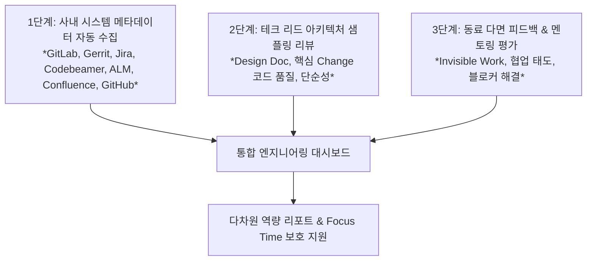

# 개발자 업무 역량 및 성과 측정 프레임워크 (시스템 메타데이터 연계 분석)

본 문서는 개발자의 업무 역량, 생산성, 기여도를 객관적이고 지속 가능하게 파악하기 위한 평가 프레임워크를 정의합니다. 사내 인프라(**GitLab/mod.lge.com, Gerrit, Jira, Codebeamer, ALM, Confluence를 포함한 Atlassian 제품군, GitHub, SMILE, 그 외 모든 git 활동**)에서 수집 가능한 **시스템 메타데이터(System Metadata)**를 활용하여 자동 분석이 가능한 영역과 불가능한 영역을 분류하고, 자동 측정이 어려운 영역에 대한 구체적인 보완 대안을 제시합니다. **이메일과 MS Teams를 비롯한 모든 MS 제품은 회사 정책상 모니터링 대상에서 영구 제외됩니다** (1.2절 참고).

> **2026-09-07 업데이트**: 사내에 이미 **SMILE**(AI 기반 코드 변경 영향 분석 플랫폼, SAAD 스페이스 Collab 문서 참고)이라는 플랫폼이 존재하며,
> 이 문서에서 "직접 만들어야 한다"고 봤던 요구사항 추적(1.5)·코드 리뷰 품질(3.1)·테스트 충분성(1.7)·코드 영향 분석(1.9)의
> 상당 부분을 SMILE이 이미 커밋/MR 단위로 자동 산출하고 있음을 확인했다. 자세한 내용은 [5장 SMILE 플랫폼 활용 방안](#5-smile-플랫폼-활용-방안-2026-09-신규-반영) 참고 —
> **커스텀 LLM 매칭 로직을 새로 만들기보다 SMILE의 기존 분석 결과를 데이터 소스로 우선 활용하는 방향으로 전략을 수정한다.**

---

## 1. 개요 및 핵심 원칙

### 1.1 기본 측정 철학 (SPACE & DORA 기반)
* **다차원 복합 측정**: 단순한 코드 생산량(Activity)에 치우치지 않고, 글로벌 표준인 **SPACE 프레임워크**(만족도, 성과, 활동, 협업, 효율성) 및 **DORA 지표**(리드타임, 배포빈도, 실패율, 복구시간)를 결합하여 다면적으로 평가합니다.
* **지원(Support) 중심 포지셔닝**: 감시나 줄세우기식 인사 평가가 아닌, 개발자의 병목(Blocker)을 해소하고 **Focus Time(몰입 시간)을 보호**하기 위한 진단 도구로 활용합니다.
* **SPACE 5차원 ↔ 본 문서 5대 대항목 대응 관계** ([space-framework.md](intents/2026-09-09-developer-expertise-grading/research/papers/space-framework.md) 참고): 대항목 1(품질)=Performance, 대항목 2(속도)=Efficiency&Flow(+Activity), 대항목 3(협업)=Communication&Collaboration, 대항목 4(문제정의/설계)=Performance의 세부 영역, 대항목 5(웰빙)=Satisfaction&Well-being. 이 대응 관계는 이미 채택한 5대 대항목 구조가 임의 분류가 아니라 SPACE 프레임워크의 실증 근거를 따른 것임을 보여준다.

### 1.2 사내 모니터링 정책 (회사 규정, 2026-09-09 확정)
> [!IMPORTANT]
> 회사 정책상 모니터링 가능/불가능 범위가 명확히 정해져 있으며, 이 문서의 모든 데이터 소스 선정은
> 아래 정책을 최우선으로 따른다.

| 구분 | 범위 |
| :--- | :--- |
| ❌ **절대 모니터링 금지** | 이메일(Outlook/Exchange 등), **MS Teams**, 그 외 모든 **MS 제품**(캘린더, 채팅, OneDrive, SharePoint 등 M365 전반) |
| ✅ **모니터링 가능** | Jira, Codebeamer, ALM, Confluence를 포함한 **Atlassian 제품군**, Gerrit, **모든 git 활동**(로컬/원격 저장소 불문), GitHub |

- 이 정책에 따라, 기존에 "⏭️ 범위 제외 (사용자 결정 보류)"로 표기했던 **Teams 관련 항목은 전부
  "❌ 회사 정책상 영구 제외"로 재분류**한다 — 추후 M365 커넥터가 연결되거나 governance 정책이 바뀌어도
  Teams/이메일/MS 제품은 이 문서의 데이터 소스 후보에서 원천적으로 제외한다(재검토 대상이 아님).
- Focus Time(2.2), 번아웃 신호(5.1), 동료 감사/멘토링(3.3) 등 기존에 Teams 데이터를 보조 소스로
  가정했던 소항목들은 **허용된 시스템(Git/Gerrit/Jira/Confluence/Codebeamer/ALM/GitHub)만으로 대체
  가능한 방식**으로 전면 수정했다(각 소항목 참고).
- Codebeamer/ALM/GitHub는 기존 문서에 없던 신규 허용 데이터 소스이며, 이를 활용한 추가 제안은
  6장("추가로 모니터링하면 좋은 항목")에 정리한다.

### 1.3 굿하트의 법칙(Goodhart's Law) 및 안티패턴 방지
> [!WARNING]
> **"측정 지표가 목표가 되는 순간, 그 지표는 더 이상 좋은 지표가 되지 못한다."**
> 단일 정량 지표(코드 라인 수, 단순 커밋 수 등)를 절대적 평가 기준으로 삼으면 왜곡된 엔지니어링 행동(Gaming the system)을 초래합니다.

| 절대 단독 평가 지표로 쓰면 안 되는 항목 | 발생하는 왜곡 및 부작용 |
| :--- | :--- |
| **코드 라인 수 (LOC, Lines of Code)** | 불필요하게 장황한 코드 작성, 라이브러리 복사-붙여넣기 유발 |
| **단순 커밋 수 / PR(Gerrit Change) 수** | 무의미한 커밋 쪼개기, 단순 오타 수정 위주의 작업 양산 |
| **Patchset 개수 (기간 고려 없이 단독 사용)** | 활발한 리뷰 피드백 반영(짧은 기간 내 다수 수정)까지 "완성도 부족"으로 오판 — [1.1](#11-패치셋-패턴-rework-rate--patchset-수--개수-단독-해석-금지) 참고 |
| **근무 시간 / 키보드·마우스 활동량** | 화면 켜두기 등 형식적 체류, 극심한 반발 및 번아웃 유발 |
| **단순 버그 수정 건수** | 아키텍처 개선 등 어렵고 근본적인 작업 기피, 쉬운 버그만 선별 처리 |
| **활동 분야 다양성 점수 (프로젝트/기술 스택 수)** | 다양성 점수를 높이려고 여러 프로젝트에 실질 기여 없는 사소한 커밋을 흩뿌리는 행동 유발 → 프로젝트당 최소 실질 기여량(예: 의미 있는 diff 크기 이상) 임계치로 정규화 필요 |

### 1.4 데이터 우선(Data-first) 원칙과 설문/자기보고 데이터의 한계 (2026-09-09 방침)
> [!NOTE]
> 이 프로젝트는 **1차적으로 시스템 메타데이터(Git/Gerrit/Jira/Codebeamer/ALM/Confluence/GitHub 로그)만으로
> "누가 일을 잘하는가"를 식별하는 것을 우선 목표로 한다.** 설문/Peer Feedback/자기 선언형 입력(예:
> Focus 태깅, Kudos)은 이번 단계의 정식 계산 지표에서 제외하고, **참고용 코멘트/향후 검토 항목으로만
> 남긴다.** 즉 각 소항목에 "보완 대안"으로 제시된 설문·자기보고 방식은 지금 구현 우선순위가 아니며,
> 데이터만으로 계산 가능한 부분을 먼저 완성한다.

이렇게 결정한 이유는 설문/자기보고 응답을 시스템 메타데이터와 동일한 "객관적 데이터"처럼 취급할 때
아래와 같은 문제가 발생하기 때문이다 — **이 한계를 인지한 채로 데이터 기반 접근을 우선 진행하고, 발생
가능한 부작용은 아래처럼 코멘트로 남겨 추후 보완한다**:

| 설문/자기보고를 데이터로 취급할 때 발생하는 문제 | 구체적 위험 |
| :--- | :--- |
| **사회적 바람직성 편향 (Social Desirability Bias)** | 응답자가 "바람직해 보이는" 답을 고르는 경향 — 특히 결과가 평가에 연결될 수 있다고 느끼면 왜곡이 커짐 |
| **응답률/선택 편향 (Non-response & Selection Bias)** | 특정 성향(불만이 많거나 반대로 매우 만족하는 사람)만 응답할 경우 표본이 전체를 대표하지 못함 |
| **동일방법편향 (Common Method Bias)** | 같은 사람이 같은 방식(설문)으로 여러 지표에 응답하면, 실제 상관관계가 아니라 응답 방식 자체 때문에 지표 간 상관이 부풀려질 수 있음 |
| **개인별 척도 보정 차이 (Calibration Drift)** | "만족도 4점"의 의미가 사람마다 달라 절대값 비교가 왜곡됨(관대화/엄격화 성향 차이) |
| **게이밍 유인** | 자기 선언형 입력(Focus 태깅, Kudos 등)이 평가에 영향을 준다고 인식되면 실제 행동과 무관하게 태깅만 늘리는 왜곡 발생 |
| **소급 회상 오류 (Recall Bias)** | 특정 시점을 지나 회고하는 설문은 최근 사건에 과도하게 영향받아 실제 패턴과 어긋날 수 있음 |

- **적용 원칙**: 위 문제들 때문에 이번 intent의 1차 산출물(spec.md 완료조건 3, 4)은 **설문/자기보고 항목을
  정식 지표 계산에 포함하지 않고, 시스템 메타데이터만으로 계산되는 값만 "데이터"로 다룬다.** 각 소항목에
  이미 기술된 자기보고/설문 기반 "보완 대안"은 즉시 구현하지 않으며, "향후 검토(참고용 코멘트)"로
  표시를 남긴다(6장 신규 항목 포함).
- **주의**: 데이터 우선 접근 자체도 부작용(Goodhart's Law, 1.3절)이 있으므로 완전히 자유로운 것은
  아니다 — "설문을 안 쓴다"는 것이 "데이터만 있으면 사람을 줄세워도 된다"는 뜻은 아니며, 7장(보안/
  거버넌스)의 인사 평가 직접 연동 금지 원칙은 데이터 우선 접근에도 동일하게 적용된다.

### 1.5 데이터 기반 극단값 해석의 비대칭 원칙 (2026-09-10 방침)
> [!NOTE]
> "정량 지표만으로 매우 잘하는 사람과 매우 안 하는(수동적인) 사람을 가려낼 수 있는가"에 대한 근거
> 기반 답이다. [Montandon et al. (2019)](intents/2026-09-09-developer-expertise-grading/research/papers/montandon-identifying-experts-github.md)의
> 실증 결과에 따르면 시스템 메타데이터의 신뢰도는 방향에 따라 **비대칭적**이다: 고활동 클러스터는 실제
> 전문가와 65~75% 일치(신뢰 가능)하지만, 저활동값으로 초보자와 숨은 전문가를 구분하는 정확도는
> F=0.56에 그친다(신뢰 불가). 이 프로젝트는 이 비대칭성을 그대로 설계 원칙으로 채택한다.

| 신호 방향 | 해석 | 이 프로젝트에서의 용도 |
| :--- | :--- | :--- |
| **고신호 (여러 독립 축에서 꾸준히 상위 + 재작업률/결함밀도 등 품질 지표도 양호)** | 신뢰할 만한 양성 지표 — 실제 고기여자일 가능성이 높음 | **인정 신호(Recognition Signal)**로 채택 — 회사가 알아보고 보상/유지(retention)에 활용할 근거로 삼을 수 있음 (1.6절) |
| **저신호 (여러 독립 축에서 장기간 지속적으로 낮음)** | 확정적 부정 지표가 아니라 판별 불능 — 숨은 전문가, 비가시 업무(멘토링·설계 검토 등), 권한 제약, 휴직/이동 등 다른 설명이 항상 가능 | **경고 신호(Warning Sign)**로만 채택 — "이 사람은 역량이 낮다"는 결론이 아니라 "매니저의 정성적 확인이 필요하다"는 트리거로만 사용 (1.6절) |

**공통 원칙**: 두 신호 모두 **단일 지표가 아니라 여러 독립적 축의 조합**으로만 산출하며(1.3절 Goodhart
안티패턴 방지), **신호 발생 자체가 최종 결론이 아니라 사람의 확인을 요구하는 트리거**다. 특히 경고
신호는 "인사조치의 근거"가 아니라 "지원/코칭 대화를 시작하라는 신호"로만 쓰인다(7장 원칙과 일치).

### 1.6 두 개의 데이터 전용 종합 신호 (설계 원칙)

이 프로젝트가 원 티켓의 "일 잘하는 사람 찾기·전문가 구분" 요구와 "인사평가 오용 금지" 원칙을
동시에 만족시키기 위해 채택하는 구체적 산출물 두 가지다. 둘 다 시스템 메타데이터만으로 계산되며
(데이터 우선 원칙, 1.4절), 산출 즉시 발행되는 최종 판단이 아니라 **후속 확인이 필요한 신호**다.

* **지속적 고기여 인정 신호 (Sustained High-Impact Recognition Signal)**
  * 산출 조건(예시, 최종 임계치는 구현 시 실측 데이터로 보정): 최근 N개월간 5대 대항목 중 3개 이상에서
    상위 구간(예: 조직 평균 대비 상위 25%)을 유지 **하면서 동시에** 1.1(재작업률)·1.3(변경 실패율) 등
    품질 지표가 평균 이하로 양호. "활동량만 많고 재작업이 많은" 패턴은 제외되도록 품질 축을 반드시 결합.
  * 용도: 회사가 이 사람의 기여를 파악해 보상·승진·리텐션 논의의 **참고 자료**로 삼음(단독 근거 아님,
    최종 판단은 여전히 사람이 함).
* **지속적 저활동 경고 신호 (Sustained Low-Engagement Warning Sign)**
  * 산출 조건(예시): 최근 N개월간(예: 3개월 이상) 5대 대항목 중 대부분(예: 4개 이상)에서 활동량이
    지속적으로 최저 구간이며, 추세도 개선되지 않음(정체/하락).
  * **반드시 지켜야 할 안전장치**:
    1. 단일 지표(예: 커밋 수)만으로 판단하지 않는다 — 최소 4개 이상 서로 다른 시스템/축의 데이터가
       동시에 낮아야 한다.
    2. 신호가 뜨면 자동으로 어떤 조치도 하지 않는다 — 매니저와의 1:1 대화를 여는 트리거로만 쓴다.
    3. 리포트에는 항상 "이 신호는 역량 부족의 증거가 아니라 확인이 필요하다는 뜻"이라는 문구를 함께
       출력한다(Montandon et al. 2019의 F=0.56 근거를 인용).
    4. 휴직/이동/타 부서 협업(비가시 업무) 등 알려진 예외는 신호 계산 전에 제외한다.
  * 용도: "공무원식 시간 때우기" 패턴처럼 관리자가 놓치기 쉬운 장기 저활동을 조기에 포착해 **지원·코칭
    대화**를 시작하는 것 — 이 자체가 징계나 평가 자료가 아님을 산출물에 항상 명시한다.

### 1.7 두 논문의 방법론 직접 적용 (결론 인용을 넘어선 방법 채택, 2026-09-10)

1.5절은 Montandon et al.(2019)의 **결론**(비대칭적 신뢰도)만 원칙으로 인용했지만, 두 논문의 실제
**방법론**도 아래와 같이 구현에 직접 반영했다 — 결론만 빌리고 방법은 재현하지 않는 것을 피하기 위함.

* **경험 원자(Experience Atom, EA) — [Mockus & Herbsleb (2002)](intents/2026-09-09-developer-expertise-grading/research/papers/mockus-herbsleb-expertise-browser.md)
  방법 그대로 채택**: 커밋이 건드린 파일 하나하나를 (모듈, 기술스택, 변경목적) 3축으로 분해해 EA로
  누적 집계하고, 이를 근거로 **전문성의 폭(breadth: EA 임계치 이상인 서로 다른 모듈 수)과 깊이
  (depth: 가장 EA가 많은 모듈의 EA 합계)를 구분**한다. 4.4절("활동 폭/다양성")이 지금까지는 "몇 개
  저장소에 손댔는지"라는 폭만 봤다면, EA 적용으로 "한 영역을 얼마나 깊게 파고들었는지"까지 함께 본다.
  구현: [scripts/dev_metrics/experience_atoms.py](scripts/dev_metrics/experience_atoms.py), 대항목
  4의 밴드 산출에 편입(`composite_signals.py`).
* **비지도 클러스터링 — [Montandon et al. (2019)](intents/2026-09-09-developer-expertise-grading/research/papers/montandon-identifying-experts-github.md)
  방법 채택 (시간축으로 재구성)**: 원 논문은 여러 사람의 GitHub 활동을 클러스터링해 고활동/저활동
  집단을 나눴지만, 이 프로젝트는 spec.md 제약상 동료 데이터를 모을 수 없다. 대신 **같은 사람의 여러
  달(month)을 각각 하나의 관측치로 보고 k=2 클러스터링**해, 고정 임계치 없이 "고활동 달 클러스터"와
  "저활동 달 클러스터"를 데이터로부터 직접 구분한다. 이 클러스터링 결과(최근 연속 몇 개월이 저활동/
  고활동 클러스터인지)를 1.6절의 두 신호가 요구하는 **"지속성(sustained)"** 판단의 실제 근거로
  사용한다 — 이전에는 단일 시점 스냅샷만으로 "관찰 필요 4개 이상"만 확인했지만, 이제는 월별
  클러스터링으로 실제 추세가 뒷받침되는지까지 확인한다. 관측치(월)가 4개 미만이면 클러스터링을 신뢰할
  수 없다고 판단해 스냅샷 기준으로만 판단하고 그 사실을 명시한다.
  구현: [scripts/dev_metrics/monthly_activity_clusters.py](scripts/dev_metrics/monthly_activity_clusters.py)
  (표준 라이브러리만으로 구현한 1차원 k=2 k-means), `composite_signals.py`의 인정/경고 신호 계산에
  통합.

### 1.8 파운데이션 모델/아키텍처 결정 (AI Flywheel 4단계, 2026-09-11)
> [!NOTE]
> 지금 이 프로젝트의 "AI"는 스크립트 내부의 LLM 추론이 아니라 **Claude Code 세션이 결정론적 Python
> 스크립트를 오케스트레이션하고 결과를 해석·서술하는 방식**이다 — `activity_breadth.py`부터
> `composite_signals.py`까지 전부 표준 라이브러리 + `git`/`gh` CLI만 쓰고 LLM API를 호출하지 않는다.
> 이 구조를 PoC 단계의 공식 아키텍처로 채택한다: 재현 가능하고(같은 입력→같은 출력), 비용이 사실상
> 0에 가깝고(LLM 추론 없음), 검증하기 쉽다. **정식 스케줄 실행(cron)이나 다인원 확장이 결정되면**
> 그때 별도 파운데이션 모델/파이프라인 아키텍처(예: Managed Agents로 정기 실행, LLM 기반 시맨틱
> 분석 추가)를 재검토한다 — 지금은 PoC 범위를 넘는 인프라 투자를 하지 않는다.

### 1.9 실행 이력 축적과 임계치 재보정 루프 (AI Flywheel 7단계, 2026-09-11)
이 문서 곳곳의 "임계치는 1차로 하드코딩하고 추후 실측 데이터로 보정 필요"라는 문구를 실행 가능하게
만드는 뼈대다. [scripts/dev_metrics/run_history.py](scripts/dev_metrics/run_history.py)가
`composite_signals.py --log-history` 실행마다 원시 근거치(코드/문서 본문은 제외 — 7장 "소스코드
원본 유출 완전 차단" 원칙 준수)를 로컬 JSON Lines로 누적하고, 샘플이 충분히 쌓이면(기본 5회 이상)
75번째 백분위 기반 재보정안을 제안한다. **자동으로 문서/스크립트를 고치지는 않는다** — 사람이 제안을
검토한 뒤 반영해야 한다(1.6절 "자동 조치 없음" 원칙과 동일). 5개 저장소로 실행 검증한 결과, 예를 들어
1.2(재수정 비율) 임계치는 현재 0.15인데 실측 75번째 백분위는 0.31로 나타나 재검토 여지가 확인됐다.

---

## 2. 5대 대항목별 소항목 메타데이터 분석 가능 여부 및 대안

> **분류 기준**:
> * `[O] 자동 수집/분석 가능`: 사내 도구(GitLab, Gerrit, Jira, Codebeamer, ALM, Confluence 등 Atlassian 제품군, GitHub)의 로그/메타데이터로 정량화 가능.
> * `[△] 부분 가능 / 조건부 가능`: 메타데이터로 신호는 포착되나, 의미론적 분석(LLM/휴리스틱)이나 정성적 검증이 병행되어야 함.
> * `[X] 자동 수집 불가`: 시스템 로그만으로는 판단할 수 없으며, 동료 평가(Peer Review)나 전문가 리뷰가 필수적임.
>
> **Claude 직접 수집 가능 여부** (이번 검토에서 추가한 표시 — 위 분류와는 별개로, *지금 이 Claude Code 세션이 MCP 연결이나 직접 작성한 코드로 바로 값을 얻어올 수 있는지*를 나타냄):
> * `✅ 즉시 가능`: 로컬 git 저장소 데이터(커밋 타임스탬프, diff, 브랜치/리비전 이력)만으로 Bash에서 `git log` 등을 직접 실행해 산출 가능. 별도 사내 시스템 접근 불필요.
> * `🔑 API 필요`: Gerrit/GitLab/Jira/Codebeamer/ALM/Confluence/GitHub REST API 엔드포인트와 인증 토큰이 주어지면 스크립트로 가능하지만, 현재 세션에는 해당 사내(mod.lge.com) 시스템에 연결된 MCP가 없어 지금 당장은 값을 가져올 수 없음.
> * `❌ 불가`: 정성적 판단 영역이라 MCP나 코드로는 애초에 산출 불가 (문서의 `[X]`와 동일).
> * `🚫 회사 정책상 영구 제외`: 이메일/MS Teams/그 외 MS 제품이 데이터 소스인 항목 — 1.2절 정책에 따라
>   기술적 가능 여부와 무관하게 수집하지 않는다(사용자 재량으로 바뀌는 `⏭️ 범위 제외`와 달리 정책적 확정 상태).

---

### 대항목 1. 코드 품질 및 완성도 (Quality & Reliability)

#### 1.1 패치셋 패턴 (Rework Rate / Patchset 수) — 개수 단독 해석 금지
* **측정 가능 여부**: `[O] 자동 수집 가능`
* **Claude 직접 수집 가능 여부**: `🔑 API 필요` — Gerrit REST 엔드포인트/토큰이 있으면 코드로 바로 가능하나, 현재 세션엔 Gerrit MCP가 연결되어 있지 않음.
* **사용 데이터 소스**: Gerrit REST API (`PATCHSET_ADDED` 이벤트, Change별 Patchset 개수 및 각 Patchset 타임스탬프)
* > [!CAUTION]
  > **Patchset 수 자체는 좋고 나쁨의 지표가 아닙니다.** Merge되기 전까지는 리뷰가 활발히 진행될수록 오히려
  > Patchset이 늘어나는 게 정상입니다 — 예를 들어 2일 이내에 5~6개 Patchset이 쌓였다면 이는 "초기 완성도
  > 부족"이 아니라 **리뷰어와 빠르게 핑퐁하며 피드백을 즉시 반영한, 오히려 바람직한 협업 패턴**일 가능성이
  > 높습니다. 이전 버전 문서의 "평균 7회 이상이면 완성도 부족"이라는 단일 기준선은 이 관점을 놓치고 있어
  > 삭제합니다.
* **메타데이터 분석 방식 (개수 대신 "시간 분포·정체 패턴"을 본다)**:
  * 단일 Change ID당 Patchset 개수뿐 아니라, **첫 Patchset ~ 마지막 Patchset(Merge) 사이의 경과일**과
    **Patchset 간 간격의 분포**를 함께 집계.
  * **정상/긍정 신호**: 짧은 기간(예: 2~3일) 내에 여러 Patchset이 촘촘하게 이어진 경우 — 활발한 리뷰
    이터레이션.
  * **주의가 필요한 신호**: 오히려 **개수가 아니라 "정체 기간"** — 동일 Change가 수 주에 걸쳐 간헐적으로
    Patchset이 추가되는 경우(예: Patchset 간 평균 간격이 7일 이상). 이는 요구사항이 도중에 바뀌었거나,
    설계 자체가 불확실한 상태로 시작했음을 시사할 수 있음.
  * **(참고, 부차적) 업로드 대비 Merge 비율**: 특정 기간 동안 본인이 Upload한 전체 Change 수 대비 실제
    Merge까지 도달한 비율/Abandon된 비율. 어느 정도 의미는 있으나(설계 방향이 자주 엎어지는지 등), 아래
    [1.5 요구사항-구현-테스트 추적성 완결률](#15-요구사항-구현-테스트-추적성-완결률-req--dev--test-traceability)이
    훨씬 더 본질적인 신호이므로 이 지표는 보조 지표로만 사용.
* **보완/주의점**: 아키텍처 논의가 필요한 대규모 Feature Change는 자연스럽게 Patchset이 많아질 수 있으므로
  변경 라인 수(Diff Size)와 결합해 정규화 필요. **"개수"가 아니라 "짧은 기간에 집중됐는가 vs 장기간
  정체됐는가"를 1차 판단 기준으로 삼는다.**

#### 1.2 단기 재수정 (Re-fix) 빈도
* **측정 가능 여부**: `[O] 자동 수집 가능`
* **Claude 직접 수집 가능 여부**: `✅ 즉시 가능 (부분)` — 로컬 git 저장소라면 `git log -p --follow`로 파일/함수 영역별 재수정 이력을 직접 분석 가능. 다만 Gerrit의 Change/Patchset 단위 메타데이터까지 반영하려면 Gerrit API가 추가로 필요.
* **사용 데이터 소스**: Gerrit Diff Patch Hunk 파싱 (`file_path`, `function_name`, `merged_at`)
* **메타데이터 분석 방식**:
  * 특정 함수/모듈이 Merge된 후 30~90일 이내에 동일 영역이 다시 수정(Fix)되는 패턴을 SQL Window 함수로 탐지.
* **보완/주의점**: 기능 확장에 의한 정상적 수정과 버그 수정을 구분하기 위해 커밋 메시지 키워드(`fix`, `bug`, `issue` 등) 및 Jira 버그 티켓 태깅 여부 교차 검증.

#### 1.3 변경 실패율 (Change Failure Rate / Hotfix, Rollback)
* **측정 가능 여부**: `[△] 부분 가능`
* **Claude 직접 수집 가능 여부**: `🔑 API 필요 (부분)` — `git log --grep`, `git revert` 이력, `hotfix/`·`revert-` 브랜치명 탐지는 로컬 git으로 바로 가능(✅). 다만 Jira 장애 티켓과의 교차 검증은 Jira API 연결이 필요.
* **사용 데이터 소스**: GitLab 브랜치/태그 이력, Gerrit Revert Change, Jira 배포/장애 티켓
* **자동화 한계 및 불가 이유**:
  * 단순히 브랜치/Gerrit 로그만으로는 특정 커밋이 장애를 유발해 Revert된 것인지, 기획 변경으로 롤백된 것인지 구분하기 어려움.
* **보완 대안**:
  * Gerrit의 `Revert` 액션 및 브랜치 내 `hotfix/`, `revert-` 접두사 태깅 자동 감지.
  * 사내 장애 관리 시스템/Jira Post-mortem 티켓과 Merge 이력(Change-Id) 연동.

#### 1.4 복잡도 대비 결함 밀도 (Defect Density vs. Complexity)
* **측정 가능 여부**: `[△] 부분 가능`
* **Claude 직접 수집 가능 여부**: `🔑 API 필요` — SonarQube 서버 API가 연결되면 코드로 가능. 단, Claude가 직접 소스에 대해 정적분석 도구(예: `radon`, `lizard` 등)를 실행해 순환 복잡도만 별도 산출하는 것은 ✅ 즉시 가능.
* **사용 데이터 소스**: SonarQube 정적 분석 메타데이터 (Cyclomatic Complexity), Jira 버그 티켓
* **자동화 한계 및 불가 이유**:
  * 코드의 줄 수나 순환 복잡도(Complexity) 대비 결함 수는 정적 분석 툴로 산출할 수 있으나, 레거시 시스템 의존성이나 비즈니스 도메인의 본질적 난이도를 온전히 반영하지 못함.
* **보완 대안**:
  * SonarQube/SonarGitLab의 정적 분석 결과(기술 부채, 취약점 지표)를 CI 단계에서 메타데이터로 연계 수집하여 참조 지표로 활용.

#### 1.5 REQ/SDD ↔ 코드 매핑 및 추적성 완결률 (Requirement/Design ↔ Implementation Traceability)
* **측정 가능 여부**: `[△] 부분 가능`
* **Claude 직접 수집 가능 여부**: `🔑 API 필요 (수집) / ✅ 즉시 가능 (매칭 분석)` — Jira/Confluence에서 REQ·SDD
  원문과 Gerrit Change를 가져오는 것 자체는 두 시스템 API가 있어야 하지만(🔑), 일단 REQ/SDD 텍스트와 코드
  diff를 둘 다 텍스트로 확보하면 그 둘을 의미 단위로 매칭하는 것은 Claude(LLM)가 지금 바로 수행 가능(✅).
* **사용 데이터 소스**: Jira(CCR/요구사항 티켓, 링크된 이슈), Confluence/Collab(SDD — Software Design
  Document), Gerrit Change(커밋 메시지의 Jira 키 태깅 + 실제 diff), 테스트 결과(테스트 케이스 티켓, CI
  테스트 리포트, QA 승인 코멘트)
* **왜 중요한가**: Patchset 개수나 단순 Merge 비율보다, **하나의 Gerrit Change가 (1) 연관 티켓이 있는지,
  (2) 그 티켓에 REQ/SDD 문서가 연결돼 있는지, (3) 실제 코드가 그 문서의 어느 조항/섹션을 구현한 것인지까지
  대응(matching)되는지**를 보면 "이 사람이 한 일이 실제로 의미 있는 일인지"를 훨씬 더 직접적으로 판단할
  수 있음. 단순히 "티켓이 링크되어 있다"는 존재 여부보다 한 단계 더 들어간 **내용 수준의 추적성**이 핵심.
* **메타데이터 분석 방식 (3단계)**:
  1. **연결 여부 확인 (존재 체크, 기계적)**: Jira 이슈 단위로 (a) 요구사항/AC가 이슈 본문에 명시됨,
     (b) 해당 이슈 키가 태깅된 Gerrit Change가 최소 1건 Merge됨, (c) 테스트 결과가 이슈에 첨부됨 — 3단계
     모두 완결된 이슈 비율(=완결률)과, 어느 단계에서 끊기는지 진단.
  2. **REQ/SDD 문서 탐색**: 연결된 Jira 이슈에서 REQ(요구사항 정의서)·SDD(설계 문서) 링크를 Confluence에서
     찾는다. 이슈 자체에 요구사항이 짧게만 적혀 있고 REQ/SDD는 별도 문서로 관리되는 경우가 많으므로, 이슈
     본문·코멘트에서 문서 링크를 추출.
  3. **내용 매칭 (LLM 기반, Claude가 즉시 수행 가능)**: REQ/SDD 문서의 조항/섹션 목록과 실제 Gerrit diff를
     함께 LLM에 제공해, "이 코드 변경이 문서의 어느 섹션/요구사항 항목을 구현한 것인지"를 매칭시킨다.
     매칭이 잘 되면(코드가 문서의 특정 조항과 명확히 대응) 의미 있는 작업으로, 매칭이 안 되거나(문서에 없는
     임의 변경) 문서 자체가 없다면 추적성이 약한 작업으로 분류.
* **부가 기능: 유사 작업 기억 및 연결 (지식 재사용)**: 이렇게 "이 Change가 REQ/SDD의 어느 부분을 구현했다"는
  매핑 결과를 누적해두면, **새로운 티켓이 들어왔을 때 과거에 유사한 REQ/SDD 조항을 구현한 이력이 있는지
  임베딩/LLM 검색으로 찾아 자동으로 연결**해줄 수 있다 (예: "이번 티켓은 예전 AGILEDEV-1057에서 구현한
  파싱 로직과 같은 모듈을 다룬다 → 그때의 설계 결정/코드를 참고하라"). 이는 Claude가 과거 Change들의
  매핑 결과(요약 텍스트)를 벡터 검색하거나 직접 훑어 판단하는 방식으로 지금도 가능하나, 이력이 쌓일수록
  실용성이 커지므로 매핑 결과를 구조화된 형태(예: `log/` 활동 파일, 별도 인덱스)로 축적해두는 것이 전제.
* **자동화 한계 및 불가 이유**: 문서 원문 자체를 가져오는 것(Jira/Confluence API)은 사내 인증이 필요하고,
  REQ/SDD 문서가 애초에 부실하거나 존재하지 않는 티켓에는 이 분석 자체를 적용할 수 없음. 또한 "매칭됨"이
  코드 품질을 보장하지는 않음 — 문서와 대응되더라도 구현이 부실할 수 있으므로 [1.7 테스트 충분성](#17-테스트-충분성-test-adequacy)과
  함께 봐야 함.
* **보완 대안**: Jira 워크플로우에 "테스트 근거 첨부" 상태 전환 조건을 강제하거나, Gerrit commit hook으로
  Jira 키 누락 커밋을 사전 차단해 추적성 데이터 자체의 결측을 줄임. REQ/SDD 문서 템플릿에 "조항 ID"를
  명시적으로 부여해두면 LLM 매칭 정확도가 크게 올라감.

#### 1.6 Reopen 횟수 및 재해결 속도
* **측정 가능 여부**: `[O] 자동 수집 가능`
* **Claude 직접 수집 가능 여부**: `🔑 API 필요` — Jira 이슈 상태 변경 이력(changelog)을 조회해야 하므로 Jira API 필요.
* **사용 데이터 소스**: Jira Changelog (`Resolved`/`Closed` → `Reopened` 상태 전이 이벤트 및 타임스탬프)
* **메타데이터 분석 방식**:
  * 이슈별 Reopen 발생 횟수 집계. Reopen이 잦다면 최초 해결(Fix)의 완성도가 낮았다는 신호로 해석 가능.
  * **다만 Reopen 횟수만 볼 게 아니라, Reopen 시점부터 재해결(다시 Resolved)까지 걸린 시간을 함께 봐야
    함** — 같은 Reopen 1회라도, 재해결까지 며칠씩 걸렸다면 원인 파악에 어려움을 겪은 것이고, 당일~1일
    이내에 빠르게 재해결됐다면 오히려 문제 대응력이 좋다는 신호로 볼 수 있음. 즉 "Reopen 횟수"와
    "Reopen→재해결 소요 시간"을 함께 봐야 공정한 해석이 됨.
* **보완/주의점**: Reopen 사유가 원 개발자의 실수인지, QA/요구사항 변경으로 인한 것인지 Jira 코멘트로
  교차 확인 필요 — 후자는 개발자 귀책이 아님.

#### 1.7 테스트 충분성 (Test Adequacy)
* **측정 가능 여부**: `[△] 부분 가능`
* **Claude 직접 수집 가능 여부**: `✅ 즉시 가능 (부분) / 🔑 API 필요 (부분)` — 로컬 저장소라면 Change의 diff에
  테스트 코드(파일 경로 패턴 `test_*`, `*_test.*`, `tests/` 등)가 포함됐는지, 커버리지 도구를 직접 실행한
  결과는 코드로 즉시 산출 가능(✅). 반면 CI 서버의 커버리지 리포트, QA 사인오프 이력은 해당 시스템 API가
  필요(🔑).
* **사용 데이터 소스**: Gerrit Diff(테스트 파일 포함 여부), CI 커버리지 리포트(코드 커버리지 증감량),
  Jira/QA 테스트 케이스 실행 결과
* **메타데이터 분석 방식**:
  * Change에 프로덕션 코드 변경만 있고 테스트 코드 변경이 없는 비율(테스트 누락 신호).
  * 커버리지 도구(coverage.py, jacoco 등) 결과의 Merge 전후 증감량.
  * 테스트 케이스 실행 결과(Pass/Fail, 실행 건수)가 이슈에 첨부됐는지 여부.
* **자동화 한계 및 불가 이유**: 테스트가 "존재"하는지는 자동 판별 가능하지만, 그 테스트가 실제 요구사항의
  핵심 시나리오/엣지 케이스를 "충분히" 커버하는지는 시스템 메타데이터만으로 판단 불가 — 결국 리뷰어/테크
  리드의 정성적 검토가 병행되어야 함.
* **보완 대안**: 정량 신호(테스트 코드 포함 여부, 커버리지 증감)는 1차 스크리닝용으로 쓰고, 커버리지가
  낮거나 테스트 코드가 아예 없는 Change를 샘플링해 [4.3 오버엔지니어링 지양](#43-오버엔지니어링-지양-simplicity)과
  유사한 방식으로 테크 리드가 정성 평가.

#### 1.8 리뷰 피드백 반영률 (Review Feedback Incorporation Rate)
* **측정 가능 여부**: `[△] 부분 가능`
* **Claude 직접 수집 가능 여부**: `🔑 API 필요 (수집) / ✅ 즉시 가능 (반영 여부 분석)` — Gerrit 코멘트와
  Patchset별 diff 원문 자체는 Gerrit API가 있어야 가져올 수 있지만(🔑), 일단 "어느 파일/라인에 무슨
  코멘트가 달렸는지"와 "다음 Patchset에서 그 위치가 어떻게 바뀌었는지"를 텍스트로 확보하면, 코멘트 취지가
  실제로 반영됐는지 판단하는 것은 Claude가 즉시 수행 가능(✅).
* **사용 데이터 소스**: Gerrit REST API (라인별 코멘트, Patchset별 diff)
* **왜 중요한가**: 리뷰를 "받았는지"보다 **리뷰 내용이 실제로 코드에 반영됐는지**가 더 중요한 신호. 코멘트만
  달리고 다음 Patchset에서 해당 부분이 그대로면, 형식적으로만 리뷰를 주고받았을 가능성이 있음.
* **메타데이터 분석 방식**:
  * 코멘트가 달린 파일/라인 범위를 특정하고, 그 코멘트 이후 올라온 Patchset의 동일 파일/영역 diff를 대조.
  * 반영(코드 변경 있음) / 미반영(코드 변경 없음, 코멘트만 남고 종료) / 논쟁 후 기각(reply로 사유 설명 후
    변경 없이 종료)을 구분 — 미반영이 곧 나쁜 신호는 아님(합당한 사유로 반려된 제안일 수 있음), 다만 사유
    없이 무시된 케이스를 가려내는 게 핵심.
  * **코멘트-다음 Patchset 간 시간 간격**도 함께 측정 — 코멘트 수신 후 얼마 만에 대응 Patchset이 올라왔는지
    (빠른 반영은 리뷰를 진지하게 받아들이는 신호).
* **자동화 한계 및 불가 이유**: 코드 변경이 "코멘트 취지를 제대로 반영했는지"(단순히 같은 줄이 바뀌었다는
  것과 "지적한 문제를 실제로 해결했다"는 것은 다름)는 LLM으로 근사할 수 있지만 완벽하지 않음 — 애매한
  케이스는 사람이 재확인 필요.
* **보완 대안**: 반영률이 낮게 나온 Change를 샘플링해 실제로 리뷰가 형식적이었는지, 아니면 정당하게 기각된
  제안이었는지 테크 리드가 확인.

#### 1.9 변경 방식: 세밀한 수정 vs Bulk 복사 (Change Granularity)
* **측정 가능 여부**: `[O] 자동 수집 가능`
* **Claude 직접 수집 가능 여부**: `✅ 즉시 가능` — Gerrit이든 로컬 git이든 diff 구조 자체(hunk 수, 삽입/삭제
  라인 분포)만으로 코드로 바로 분석 가능. 사내 API 없이도 diff 텍스트만 있으면 됨.
* **사용 데이터 소스**: Gerrit/git Diff 구조 (hunk 개수, 연속 삽입 블록 크기, 파일당 변경 라인 분포)
* **왜 중요한가**: 같은 "+500줄"이라도, 기존 로직 곳곳을 세밀하게 고친 것과 어딘가에서 통째로 복사해 붙여
  넣은 것은 업무의 성격이 전혀 다름. 후자는 설계·이해 없이 코드를 이식했을 가능성을 시사.
* **메타데이터 분석 방식**:
  * **Hunk 밀도**: 총 변경 라인 수 대비 hunk(연속 변경 블록) 개수 — hunk가 적고 각 블록이 크면(예: 변경
    300줄이 통째로 1~2개 hunk) "한 덩어리 삽입/교체"에 가깝고, hunk가 많고 각 블록이 작으면(예: 300줄이
    30개 hunk로 분산) 기존 코드 곳곳을 세밀하게 손본 패턴에 가까움.
  * **신규 파일 통째 추가 vs 기존 파일 부분 수정 비율**: Change 내 파일들이 대부분 "완전 신규 추가"인지
    "기존 파일의 일부 수정"인지 분포를 봄 — 신규 기능 개발이면 전자가 자연스러울 수 있으므로 이 지표
    단독으로 "나쁘다"고 판단하지 않고 커밋 메시지/이슈 타입(신규 기능 vs 버그 수정)과 함께 해석.
  * **외부 소스 유사도(참고용)**: 삽입된 코드 블록이 공개 라이브러리/StackOverflow 등과 매우 유사하면(주석
    스타일, 변수명 패턴 등) 외부 코드를 그대로 가져왔을 가능성 — 이 자체가 문제는 아니지만(라이브러리
    재사용은 정상적인 엔지니어링), 정황상 이해 없이 복붙했는지 판단하는 보조 신호로만 사용.
* **보완/주의점**: 신규 기능 개발, 대규모 리팩토링, 코드 생성기 산출물 등은 자연스럽게 "덩어리형" 변경이
  많으므로, 이 지표만으로 "성실하지 않다"고 단정하면 안 됨 — 어디까지나 [4.3 오버엔지니어링 지양](#43-오버엔지니어링-지양-simplicity)처럼
  샘플링 정성 리뷰를 트리거하는 참고 신호로 사용.

#### 1.10 소스 코드 내 설명/추적성 주석 충실도 (In-code Documentation & Traceability)
* **측정 가능 여부**: `[O] 자동 수집 가능`
* **Claude 직접 수집 가능 여부**: `✅ 즉시 가능` — diff에서 추가된 코드 라인 중 주석 비율, 그리고 요구사항
  ID/티켓 키 패턴(`AGILEDEV-\d+`, `REQ-\d+`, `SDD §\d+` 등) 참조 여부는 로컬 diff 텍스트만으로 정규식/LLM
  분석이 바로 가능.
* **사용 데이터 소스**: Gerrit/git Diff (추가된 코드 라인, 주석/docstring, 함수·클래스 시그니처)
* **왜 중요한가**: 변경된 소스에 "왜 이렇게 했는지"에 대한 설명이 충실히 달려 있고, 나아가 그 부분이
  어떤 요구사항/설계 문서에 대응하는지까지 코드 안에 표시돼 있으면(예: `# Implements AGILEDEV-1090 REQ-3`),
  나중에 그 코드를 보는 사람(리뷰어, 후임자, 본인)이 맥락을 훨씬 빨리 파악할 수 있음 — 이런 표기 습관 자체가
  "일을 더 잘하는" 신호로 볼 수 있음.
* **메타데이터 분석 방식**:
  * **주석 밀도**: 추가된 비-공백 코드 라인 대비 주석/docstring 라인 비율. 복잡한 로직(순환 복잡도가 높은
    함수, [1.4](#14-복잡도-대비-결함-밀도-defect-density-vs-complexity) 참고)일수록 이 비율이 낮으면 주의
    신호.
  * **요구사항/티켓 ID 코드 내 참조 비율**: 신규/변경 함수·모듈 상단에 관련 Jira 키나 REQ/SDD 조항 ID를
    주석으로 남긴 Change의 비율. 이런 참조가 있으면 [1.5](#15-reqsdd--코드-매핑-및-추적성-완결률-requirementdesign--implementation-traceability)의
    LLM 매칭 정확도도 함께 올라감(사람이 이미 명시해둔 매핑이므로 검증이 쉬움).
  * **함수/클래스 docstring 존재율**: 신규 public 함수·클래스에 docstring/설명 주석이 달려 있는 비율.
* **자동화 한계 및 불가 이유**: 주석이 "있다"는 것과 "정확하고 유용하다"는 것은 다름 — 형식적으로 한 줄
  써넣은 것과 실제로 맥락을 설명한 것을 자동으로 구분하기는 어려움(LLM으로 근사 평가는 가능하나 완벽하지
  않음).
* **보완 대안**: 주석 밀도가 극단적으로 낮은 Change(복잡도는 높은데 설명이 없는 경우)를 샘플링해 리뷰어가
  정성 평가. 팀 컨벤션으로 "요구사항 ID를 코드 주석에 남긴다"를 코드 리뷰 체크리스트에 포함시키면 이 지표의
  자동 수집 정확도도 함께 올라감.

---

### 대항목 2. 개발 속도와 흐름 (Velocity & Flow)

#### 2.1 변경 리드 타임 (Lead Time for Changes)
* **측정 가능 여부**: `[O] 자동 수집 가능`
* **Claude 직접 수집 가능 여부**: `✅ 즉시 가능 (부분)` — 로컬 git의 최초 커밋~병합 커밋 타임스탬프 차이는 `git log`로 바로 계산 가능. Gerrit First Upload 시각처럼 Gerrit 서버에만 있는 값은 Gerrit API 필요(🔑).
* **사용 데이터 소스**: GitLab 브랜치/MR 생성 시점, Gerrit First Upload ~ Final Submit 시각
* **메타데이터 분석 방식**:
  * `mod.lge.com` Feature 브랜치 최초 커밋 시점부터 Gerrit Merge 완료까지의 소요 시간을 자동 계산 (Pre-Gerrit to Gerrit Transition Time).
* **보완/주의점**: 외부 의존성(기획 대기, 타 부서 API 미완료)으로 인한 지연 여부를 감안하기 위해 리뷰 대기 시간과 실제 작업 시간을 분리 집계.

#### 2.2 몰입 시간 확보율 (Focus Time)
* **측정 가능 여부**: `[△] 부분 가능 (하이브리드 추정)`
* **Claude 직접 수집 가능 여부**: `✅ 즉시 가능 (Git 부분) / 🔑 API 필요 (Jira/Gerrit 부분) / 🚫 Teams 캘린더 연동은 회사 정책상 영구 제외` — 커밋 타임스탬프 기반 Inter-Event Gap 분석은 로컬 git으로 즉시 가능. Teams 캘린더를 이용한 Inverse Calendar Block은 정책상 원천 배제.
* **사용 데이터 소스**: GitLab/Gerrit 커밋 타임스탬프 세션, Jira 티켓 상태 전이(`In Progress` 진입~다음 전이) 시각, Gerrit Change Open~Submit 구간
* **자동화 한계 및 불가 이유**:
  * 로그는 '발생 시점(Point-in-Time)'일 뿐, 화면 앞에서 실제로 얼마나 집중했는지(From-To)는 직접 측정 불가.
  * Teams 캘린더 기반 "회의 없는 빈 블록" 추정은 회사 정책상 애초에 사용할 수 없음 — 아래 대안은 모두
    허용된 시스템(Git/Gerrit/Jira/Confluence)만으로 구성.
* **보완 대안**:
  * **Inter-Event Gap 휴리스틱**: 2시간 이내 연속 커밋/활동을 하나의 Focus 세션으로 묶음. (데이터 우선
    원칙에 따른 1차 구현 대상 — 시스템 메타데이터만으로 계산)
  * **Jira 상태 전이 기반 작업 세션 추정**: 티켓이 `In Progress`로 전이된 시각부터 다음 상태 전이/코멘트까지의 구간을 작업 세션 후보로 간주(캘린더 대체 근사치). (데이터 우선 원칙에 따른 1차 구현 대상)
  * *(향후 검토, 미구현)* **자기 선언형(Self-Report) 인터페이스**: Jira 코멘트 태그나 Confluence 워크로그로 Focus 모드를 선언하는 방식 — 1.4절의 게이밍 유인/사회적 바람직성 편향 위험 때문에 이번 intent의 정식 지표 계산에는 포함하지 않는다.

#### 2.3 진행 중 작업 (WIP, Work In Progress) 관리
* **측정 가능 여부**: `[O] 자동 수집 가능`
* **Claude 직접 수집 가능 여부**: `🔑 API 필요` — Jira/Gerrit REST API 연결이 필요. 참고로 이 세션에는 `mcp__claude_ai_Atlassian_Rovo` 인증 도구가 있으나 이는 사내 `mod.lge.com` Jira가 아닌 클라우드 Atlassian 계정 연동용이라 별도 확인 필요.
* **사용 데이터 소스**: Jira 상태(`In Progress` 티켓 수), Gerrit 미완료 Open Change 수
* **메타데이터 분석 방식**:
  * 한 개발자에게 동시에 `In Progress`로 열려 있는 Jira 티켓 수 및 병렬 검토 중인 Gerrit Open Change 수를 일자별로 트래킹.
  * 동시 다발적 진행(WIP > 3~4건) 시 컨텍스트 스위칭 오버헤드로 판정.

#### 2.4 Jira 착수 리드타임 & 실제 수행 시간
* **측정 가능 여부**: `[O] 자동 수집 가능`
* **Claude 직접 수집 가능 여부**: `🔑 API 필요` — Jira 이슈 상태 변경 이력(changelog) 조회를 위해 Jira API 필요.
* **사용 데이터 소스**: Jira Changelog (상태 전이 이벤트 타임스탬프: `To Do`→`In Progress`→...→`Resolved`)
* **왜 중요한가**: 이슈가 "생성된 시점"과 "실제로 손을 대기 시작한 시점"은 다른 경우가 많음(우선순위 대기,
  선행 이슈 블로킹 등). 이 둘을 구분하지 않으면 리드타임이 개발자의 실제 속도를 왜곡해서 보여줌.
* **메타데이터 분석 방식**:
  * **착수 지연(Time to Start)**: 이슈 생성 시각 ~ 최초로 `In Progress`(혹은 동등 상태)로 전환된 시각.
    이 값이 크다면 개발자의 처리 속도 문제가 아니라 **우선순위 배정/큐 대기 문제**일 가능성이 높음 —
    개인 평가보다 팀 차원의 백로그 관리 지표로 우선 해석.
  * **실제 수행 시간(Actual Effort Duration)**: `In Progress` 상태로 머문 시간의 **누적 합**(중간에
    `Blocked`/`Holding`으로 빠졌다가 재개하는 경우가 많으므로 최초~최종이 아니라 실제 `In Progress` 구간만
    합산). 이 값이 실제 개발에 투입된 순수 작업 시간에 가까움.
  * 두 값을 함께 보면 "일이 늦게 시작돼서 늦은 것"과 "시작은 빨랐는데 오래 걸린 것"을 구분할 수 있음.
* **보완/주의점**: `Blocked`/`Holding` 사유가 외부 의존성(타 팀 API 대기, 기획 확정 대기)인지 본인 사정인지
  Jira 코멘트로 교차 확인 필요 — 전자를 개발자 귀책으로 해석하면 안 됨.

---

### 대항목 3. 협업 및 팀 기여도 (Collaboration & Citizenship)

#### 3.1 코드 리뷰 기여도 (Review Quality & Turnaround Time)
* **측정 가능 여부**: `[△] 부분 가능`
* **Claude 직접 수집 가능 여부**: `🔑 API 필요 (수집) / ✅ 즉시 가능 (분석)` — 리뷰 코멘트 원문 자체는 Gerrit API로 가져와야 하지만(🔑), 일단 텍스트만 확보되면 아래의 "의미있는 리뷰" 판별을 Claude가 지금 바로 수행 가능.
* **사용 데이터 소스**: Gerrit REST API (Reviewer 할당, 라인별 `COMMENT`, `VOTE` 타임스탬프, 코멘트 길이·위치, Patchset별 diff)
* **"의미있는 리뷰"를 구체적으로 무엇으로 판별하는가** (막연히 "좋은 리뷰인지 LLM에게 물어본다"는 그 자체로는
  기준이 없으므로, 아래처럼 **관찰 가능한 신호**로 분해한다):
  * **코드 라인 단위 코멘트 비율**: Change 전체에 대한 단발성 코멘트(`LGTM`, `+1` 등)가 아니라, 특정
    파일·라인을 짚어서 남긴 인라인 코멘트의 비율. 라인 단위 코멘트가 많을수록 "꼼꼼하게 코드를 읽고
    리뷰했다"는 신호에 가까움.
  * **코멘트당 구체성**: 코멘트 본문에 코드 스니펫 인용, 구체적인 변수/함수명 언급, 대안 코드 제시가
    있는지(정규식/LLM으로 판별) — "이 부분 확인해주세요" 같은 모호한 코멘트와 "이 함수는 N=0일 때
    ZeroDivisionError가 날 수 있습니다, 아래처럼 가드를 추가하는 게 어떨까요" 같은 구체적 지적을 구분.
  * **후속 스레드(reply) 존재율**: 코멘트에 대해 작성자-리뷰어 간 답글이 오갔는지 — 단순 통보가 아니라
    실제 논의가 있었다는 신호.
  * **[1.8 리뷰 피드백 반영률](#18-리뷰-피드백-반영률-review-feedback-incorporation-rate)과 연계**: 남긴
    코멘트가 실제로 다음 Patchset에 반영됐는지까지 보면, "리뷰를 많이 남기지만 다 무시당하는 사람"과
    "적더라도 핵심을 짚어 실제로 반영되는 사람"을 구분할 수 있음.
  * 위 신호들을 종합해 리뷰어별로 "커버한 Change 수(양) × 라인단위 비율·구체성·반영률(질)"을 함께 보고,
    양과 질 중 어느 한쪽만으로 줄세우지 않는다.
* **자동화 한계 및 불가 이유**:
  * 리뷰 응답 속도(Turnaround Time)와 리뷰 참여 횟수는 완벽히 측정 가능하나, 위 신호들도 결국 근사치이며
    "기술적으로 맞는 지적인지"까지는 도메인 지식이 있는 사람의 확인이 필요.
* **보완 대안**:
  * **정량 지표**: 리뷰 요청 수신 후 첫 피드백까지의 시간(평균 응답 속도), 리뷰한 Change 개수, 라인단위
    코멘트 비율.
  * **LLM 시맨틱 분석**: 리뷰 코멘트 본문을 LLM으로 분석해 위 신호(구체성, 반영 여부)를 함께 점수화.
    단, "OK/LGTM류만 걸러낸다"처럼 단순 이분류로 끝내지 않고, 위에 나열한 다차원 신호를 함께 제시해야
    특정 리뷰 스타일(예: 짧지만 핵심을 찌르는 코멘트)이 부당하게 낮은 점수를 받지 않도록 함.

#### 3.2 지식 자산화 및 문서화 (Documentation)
* **측정 가능 여부**: `[O] 자동 수집 가능`
* **Claude 직접 수집 가능 여부**: `🔑 API 필요` — 사내 Confluence/Collab에 연결된 MCP가 없어 지금은 불가. (참고: `claude.ai Notion` MCP는 연결되어 있으나 사내 Collab과는 별개 시스템.)
* **사용 데이터 소스**: Confluence/Collab REST API (신규 페이지 생성, 문서 편집, 테크 위키 기여)
* **메타데이터 분석 방식**:
  * 작성자 ID 기준 신규 기술 문서 생성 수, 주요 기술 페이지 업데이트 이력 집계.
  * 소스 코드 개발(GitLab/Gerrit) 대비 Collab 기술 문서 산출 비율(Collab 지식 자산화율) 산출.

#### 3.3 블로커 해결 및 동료 멘토링 (Invisible Work / Support)
* **측정 가능 여부**: `[X] 자동 수집 불가`
* **Claude 직접 수집 가능 여부**: `❌ 불가 (핵심 부분) / 🔑 API 필요 (보조 신호)`
* **사용 데이터 소스**: 없음 (Teams DM/구두 대화는 회사 정책상 모니터링 금지) — 보조 신호로 Gerrit 리뷰 코멘트, Jira 코멘트, Confluence 페이지 코멘트/멘션
* **자동화 한계 및 불가 이유**:
  * 동료 자리로 가서 도와주거나, 1:1 통화/페어 프로그래밍을 통해 문제를 해결해 준 내역은 메타데이터 로그에 남지 않으며, Teams DM/음성 대화는 애초에 모니터링 대상이 아님(1.2절 정책).
* **보완 대안**:
  * **Gerrit 리뷰 코멘트 중 "도움/멘토링" 성격 분류**: 3.1의 LLM 시맨틱 분석을 확장해, 단순 리뷰를 넘어 다른 개발자의 질문에 상세히 답하거나 대안 코드를 제시한 코멘트를 별도 태깅. (데이터 우선 원칙에 따른 1차 구현 대상 — Gerrit 로그만으로 계산)
  * *(향후 검토, 미구현)* **Peer Feedback (동료 다면 평가)**: 분기/반기별 "가장 큰 기술적 도움을 준 동료" 추천 제도.
  * *(향후 검토, 미구현)* **Jira/Confluence 기반 감사(Kudos) 태깅**: 자발적 감사 인사 태깅 — 1.4절의 게이밍 유인/응답 편향 위험 때문에 이번 intent의 정식 지표 계산에는 포함하지 않는다.
  * *(향후 검토, 미구현 — Spotify Squad Health Check 스타일 정성 자가진단 템플릿)*: 정량화하지 않는
    팀 단위 자가진단 방식([company-practices.md](intents/2026-09-09-developer-expertise-grading/research/company-practices.md) §2 참고). 도입 시 반기 1회, 아래와 같은 5~7개 질문에
    Red/Yellow/Green + 자유 서술로 답하는 형식을 제안한다(개인 순위화가 아니라 팀 단위 토론 도구):
    1. 막힌 문제를 물어볼 사람을 쉽게 찾을 수 있었나? (Red/Yellow/Green)
    2. 리뷰/멘토링에 쓴 시간이 부담되지 않았나?
    3. 다른 사람을 도와준 경험이 있다면 무엇이었나? (자유 서술)
    4. 팀 내 지식 공유(문서화, 세션 등)가 충분했나?
    5. 도움을 요청했을 때 응답이 충분히 빨랐나?
    이 방식은 1.4절의 CMB(공통방법편향)·사회적 바람직성 편향 위험을 줄이기 위해 **개인이 아니라 팀
    단위로 집계**하고, 결과를 정량 점수화하지 않는다는 조건에서만 향후 도입을 검토한다.

---

### 대항목 4. 문제 정의 및 설계 역량 (Problem Solving & Complexity)

#### 4.1 선행 검증 및 PoC 수행 능력
* **측정 가능 여부**: `[O] 자동 수집 가능`
* **Claude 직접 수집 가능 여부**: `✅ 즉시 가능 (부분)` — 로컬 git의 브랜치 목록/생성 이력(`git branch`, `git log --all`)은 바로 조회 가능. Collab POC 보고서 존재 여부는 Confluence API 필요(🔑).
* **사용 데이터 소스**: GitLab(`mod.lge.com`) POC 저장소/브랜치 생성 이력, Collab POC 보고서
* **메타데이터 분석 방식**:
  * 정식 Gerrit 서브밋 이전 선행 POC 저장소에서의 사전 검증 커밋 및 Collab 기술 검증 보고서 작성 빈도 추출.

#### 4.2 요구사항 분석 및 설계 명확성
* **측정 가능 여부**: `[X] 자동 수집 불가`
* **Claude 직접 수집 가능 여부**: `❌ 불가`
* **사용 데이터 소스**: 없음 (정성적 영역)
* **자동화 한계 및 불가 이유**:
  * 기획이나 스펙의 모호한 점을 사전에 발견해 기획자/고객과 조율한 행동은 시스템 로그로 정량화할 수 없음.
* **보완 대안**:
  * **Design Doc / RFC 리뷰 프로세스**: 개발 착수 전 작성하는 아키텍처 설계 문서(Design Doc)에 대한 테크 리드 및 시니어 엔지니어의 사전 리뷰 평가.

#### 4.3 오버엔지니어링 지양 (Simplicity)
* **측정 가능 여부**: `[X] 자동 수집 불가`
* **Claude 직접 수집 가능 여부**: `❌ 불가 (판단 자체는 정성적)` — 다만 특정 Change/PR 코드에 대해 "이 패턴이 과도한지"를 리뷰하는 것 자체는 Claude가 `/code-review`로 정성 분석을 보조할 수 있음(측정 지표화는 여전히 불가).
* **사용 데이터 소스**: 없음 (정성적 영역)
* **자동화 한계 및 불가 이유**:
  * 도입된 디자인 패턴이나 라이브러리가 당면 과제에 비해 과도한지(Over-engineering) 적절한지는 오직 도메인을 이해하는 전문가의 코드 리뷰로만 판단 가능.
* **보완 대안**:
  * **Architecture Review (샘플링 코드 리뷰)**: 주기적으로 대표 Merge Change를 선정하여 아키텍처 단순성 및 유지보수성을 테크 리드가 정성 평가.

#### 4.4 활동 폭/다양성 (Activity Breadth / Diversity) — 신규, AGILEDEV-1118
* **측정 가능 여부**: `[O] 자동 수집 가능`
* **Claude 직접 수집 가능 여부**: `✅ 즉시 가능 (로컬 다중 저장소) / 🔑 API 필요 (GitHub/Gerrit/Jira까지 확장 시, 6.3절)`
* **사용 데이터 소스**: 로컬 git 다중 저장소의 커밋·변경 라인 수·파일 확장자, (확장 시) Gerrit 프로젝트 분포, Jira 이슈 유형/참여 프로젝트 수, GitHub 기여 이력
* **메타데이터 분석 방식**:
  * 저장소별 커밋 수와 변경 라인 수(추가+삭제)를 집계하고, 저장소당 최소 실질 기여량 임계치(기본 20줄) 이상인 저장소만 "실질 기여 저장소"로 인정한 뒤 개수를 산출.
  * 실질 기여 저장소들에서 건드린 파일 확장자(기술 스택) 종류 수를 집계.
  * **경험 원자(EA) 기반 깊이(depth) 보강** (1.7절, Mockus & Herbsleb 2002): 저장소 내부를 (모듈,
    기술스택, 변경목적) 3축으로 더 잘게 쪼개 EA를 누적 집계하고, breadth(EA 임계치 이상 모듈 수)와
    depth(가장 EA가 많은 모듈의 EA 합계)를 함께 산출 — "여러 곳을 얕게" vs "한 곳을 깊게"를 구분한다.
* **보완/주의점**: 다양성 점수를 높이려고 여러 저장소에 사소한 커밋을 흩뿌리는 게이밍 위험이 있다(1.3절 안티패턴 표 5번째 행) — 임계치 정규화로 방지한다. 1.5절 비대칭 원칙에 따라, 이 값이 "낮다"고 곧 활동 폭이 좁다는 부정적 결론을 내리지 않는다(비공개/레거시 시스템 위주 근무, 접근 권한 제약 등 다른 설명이 항상 가능).
* **구현**: [scripts/dev_metrics/activity_breadth.py](scripts/dev_metrics/activity_breadth.py) (저장소 단위 폭),
  [scripts/dev_metrics/experience_atoms.py](scripts/dev_metrics/experience_atoms.py) (모듈 단위 폭/깊이).

---

### 대항목 5. 지속 가능성 및 웰빙 (Sustainability & Well-being)

#### 5.1 번아웃 위험도 (Burnout Signals)
* **측정 가능 여부**: `[O] 자동 수집 가능`
* **Claude 직접 수집 가능 여부**: `✅ 즉시 가능 (Git) / 🔑 API 필요 (Jira/Gerrit 부분) / 🚫 Teams 회의 시간 합산은 회사 정책상 영구 제외` — 야간/주말 커밋 빈도는 `git log --date=iso`로 바로 집계 가능.
* **사용 데이터 소스**: GitLab/Gerrit 타임스탬프 (야간/주말 활동), Jira 티켓 상태 전이·코멘트 시각(야간/주말 업무 처리 보조 신호)
* **메타데이터 분석 방식**:
  * 정규 근무시간 외(오후 9시 이후 또는 주말) 커밋/Gerrit 업로드 빈도 트렌드 추적.
  * Jira 티켓 상태 변경/코멘트 작성 타임스탬프도 동일하게 야간/주말 활동 보조 신호로 집계(회의 시간 대신 "업무 처리 시각"으로 대체 근사).
* **보완/주의점**: 개인의 자율 근무 패턴(유연근무제)일 수 있으므로 평가가 아닌 웰빙 케어 알림(Support Notification) 용도로만 사용. 회의 시간 데이터는 정책상 구할 수 없으므로 "코딩 시간이 회의로 잠식되는지"는 이 지표로 직접 판단하지 않는다(한계로 명시).

#### 5.2 주도적 개선 태도 (Post-mortem & Feedback Culture)
* **측정 가능 여부**: `[△] 부분 가능`
* **Claude 직접 수집 가능 여부**: `🔑 API 필요` — Collab/Jira 모두 사내 시스템이라 연결된 MCP가 없어 지금은 불가. API/토큰이 주어지면 스크립트로 문서 존재 여부와 티켓 완결율 조회는 가능.
* **사용 데이터 소스**: Collab 회고(Post-mortem) 문서, Jira 회고 액션 아이템 티켓
* **자동화 한계 및 불가 이유**:
  * 회고 문서의 존재 여부는 수집 가능하나, 실패를 통해 실질적인 재발 방지책을 실행했는지는 정성적 판단 필요.
* **보완 대안**:
  * 장애 발생 후 Collab 사후 분석서(Post-mortem) 작성 여부 및 후속 개선 티켓 완결율을 연결하여 확인.

---

## 3. 시스템 메타데이터 실현 가능성 종합 매트릭스 (Summary Matrix)

| 대항목 | 세부 소항목 | 자동화 가능 여부 | Claude 직접 수집 가능 여부 | 주요 데이터 소스 | 불가 이유 및 한계 | 권장 보완 대안 |
| :--- | :--- | :---: | :---: | :--- | :--- | :--- |
| **1. 품질 & 완성도** | 1.1 패치셋 패턴 (개수 아닌 시간분포) | **[O]** | 🔑 API 필요 | Gerrit REST API | 개수 단독 해석 금지(본문 경고 참고) | 정체 기간·Patchset 간격 기반 재해석 |
| | 1.2 단기 재수정 (Re-fix) 빈도 | **[O]** | ✅ 즉시 가능(부분) | Gerrit Diff Hunk Header | 단순 기능 확장과 오인 가능 | 커밋 메시지(Fix/Bug) 및 Jira 연동 |
| | 1.3 변경 실패율 (Hotfix/Revert) | **[△]** | 🔑 API 필요(부분 ✅) | Gerrit Revert, GitLab Tag | 기획 변경에 의한 롤백과 혼재 | Jira 장애 티켓 및 Revert 사유 매핑 |
| | 1.4 복잡도 대비 결함 밀도 | **[△]** | 🔑 API 필요(부분 ✅) | SonarQube, Jira Bugs | 본질적 도메인 난이도 반영 한계 | 정적 분석 지표를 CI 파이프라인 연계 |
| | 1.5 REQ/SDD↔코드 매핑 및 추적성 | **[△]** | 🔑 수집 / ✅ 매칭분석 | Jira+Confluence(REQ/SDD)+Gerrit Diff | 문서 자체 부재/부실 시 적용 불가 | REQ/SDD 조항 ID 부여, 매핑 이력 누적·재사용 |
| | 1.6 Reopen 횟수 및 재해결 속도 | **[O]** | 🔑 API 필요 | Jira Changelog | Reopen 사유(귀책) 구분 필요 | 코멘트로 귀책 여부 교차 확인 |
| | 1.7 테스트 충분성 | **[△]** | ✅ 부분(로컬 diff/커버리지) / 🔑 부분(CI 리포트) | Gerrit Diff, CI Coverage | "충분성"의 질은 정성 판단 필요 | 저커버리지 Change 샘플링 정성 리뷰 |
| | 1.8 리뷰 피드백 반영률 | **[△]** | 🔑 수집 / ✅ 반영분석 | Gerrit Comments + Patchset Diff | "취지 반영" 판별은 LLM 근사치 | 반영률 낮은 Change 샘플링 확인 |
| | 1.9 변경 방식(세밀 vs Bulk) | **[O]** | ✅ 즉시 가능 | Gerrit/git Diff 구조(hunk) | 신규기능/리팩토링은 자연히 덩어리형 | 커밋유형과 함께 해석, 정성 리뷰 트리거 |
| | 1.10 소스 내 설명/추적성 주석 | **[O]** | ✅ 즉시 가능 | Gerrit/git Diff(주석, docstring) | "있음"과 "유용함"은 다름 | 저밀도 Change 샘플링, 리뷰 체크리스트화 |
| **2. 속도 & 흐름** | 2.1 변경 리드 타임 | **[O]** | ✅ 즉시 가능(부분) | GitLab, Gerrit Submit | 외부 병목(타팀 대기) 구분 필요 | 순수 리뷰 대기 시간 분리 산출 |
| | 2.2 몰입 시간 확보율 (Focus) | **[△]** | ✅ Git / 🔑 Jira,Gerrit / 🚫 Teams 정책상 제외 | Git Session, Jira 상태 전이 | Point-in-Time 로그의 한계 | Inter-Event Gap + Jira 상태전이(1차) / 자기선언 보정(향후 검토, 미구현) |
| | 2.3 진행 중 작업 (WIP) 관리 | **[O]** | 🔑 API 필요 | Jira `In Progress`, Open Changes | - | 동시 작업 3건 초과 시 알림 |
| | 2.4 Jira 착수 리드타임 & 실제 수행시간 | **[O]** | 🔑 API 필요 | Jira Changelog | Blocked 사유(귀책) 구분 필요 | 외부 의존 대기 사유 코멘트로 교차 확인 |
| **3. 협업 & 기여도** | 3.1 코드 리뷰 기여도 | **[△]** | 🔑 수집 필요 / ✅ 분석 가능 | Gerrit Comments/Votes/Diff | 단순 승인(+1)과 실질 조언 구분 불가 | 라인단위 비율·구체성·반영률(1.8)로 다차원 판별 |
| | 3.2 지식 자산화 (문서화) | **[O]** | 🔑 API 필요 | Confluence/Collab API | - | 코드 대비 기술 문서 생성 비율 산출 |
| | 3.3 블로커 해결 & 멘토링 | **[X]** | ❌ 불가 (핵심) / 🔑 보조신호 | Teams DM 등은 정책상 제외, 보조: Gerrit/Jira 코멘트 | 구두 지원 및 DM 등 비가시적 소통 | Gerrit 코멘트 성격 분류(1차) / Peer 360·Kudos(향후 검토, 미구현) |
| **4. 문제정의 & 설계** | 4.1 선행 PoC 수행 능력 | **[O]** | ✅ 즉시 가능(부분) | GitLab POC Repos, Collab | - | 정식 서브밋 전 선행 검증 이력 집계 |
| | 4.2 요구사항 분석 & 설계 | **[X]** | ❌ 불가 | 없음 (정성적 영역) | 초기 기획 조율 행동은 로그 부재 | Design Doc / RFC 사전 리뷰 프로세스 |
| | 4.3 오버엔지니어링 지양 | **[X]** | ❌ 불가 | 없음 (정성적 영역) | 기술 스택 적합성은 전문가 판단 영역 | 테크 리드의 샘플링 아키텍처 리뷰 |
| | 4.4 활동 폭/다양성 (신규) | **[O]** | ✅ 즉시 가능(로컬 다중 저장소) | Git 다중 저장소, (확장) Gerrit/Jira/GitHub | 저장소당 실질 기여량 정규화 필요, 낮은 값이 곧 역량 부족은 아님(1.5절) | 최소 변경 라인 임계치로 게이밍 방지(activity_breadth.py) |
| **5. 지속성 & 웰빙** | 5.1 번아웃 위험도 (야간/주말 활동) | **[O]** | ✅ Git / 🔑 Jira / 🚫 Teams 회의시간 정책상 제외 | Git Timestamps, Jira 상태전이 | 유연근무제에 따른 개인차 존재, 회의시간 데이터 부재 | 웰빙 케어 알림(Support)으로만 활용 |
| **5. 지속성 & 웰빙** | 5.2 주도적 개선 (Post-mortem) | **[△]** | 🔑 API 필요 | Collab Post-mortem, Jira | 문서 존재만으로 실행력 담보 불가 | 장애 후속 개선 티켓 완결율 추적 |

---

## 4. 정량 메타데이터 한계 극복을 위한 3단계 하이브리드 평가 체계

시스템 메타데이터 분석(`[O]`, `[△]`)으로 확보된 정량 신호의 한계를 보완하기 위해, 아래와 같은 **3단계 하이브리드 체계**로 종합 평가 및 리소스 관리를 수행해야 합니다.

1. **1단계: 시스템 메타데이터 기반 객관적 신호 도출 (Objective Signals)**
   * 리드타임, 착수 지연/실제 수행시간, 패치셋 시간분포(Re-fix), REQ/SDD↔코드 추적성, 리뷰 반영률, 변경
     방식(세밀/Bulk), 소스 내 추적성 주석, Reopen·재해결 속도, 문서화율, WIP, Focus Time 분포 등 사실(Fact)
     기반의 기초 데이터 산출.
2. **2단계: 테크 리드 전문가 샘플링 리뷰 (Expert Qualitative Review)**
   * 반기별로 개발자의 대표 변경 이력(Feature Change) 2~3건을 선정하여 설계 명확성, 오버엔지니어링 여부, 테스트 품질을 정성 평가.
3. **3단계: 상호 다면 피드백 및 자발적 기여 인정 (Peer Feedback & Citizenship)**
   * 보이지 않는 도움(Invisible Support), 온보딩 기여, 명확한 커뮤니케이션을 동료 피드백을 통해 보완.

---

## 5. SMILE 플랫폼 활용 방안 (2026-09 신규 반영)

> 출처: Collab SAAD 스페이스 [SMILE User Guide](http://collab.lge.com/main/spaces/SAAD/pages/3800498513/) /
> [SMILE Release Notes](http://collab.lge.com/main/spaces/SAAD/pages/3815244051/) (v1.0.0-preview, 2026-09-04) —
> 두 페이지 원문을 직접 조회해 확인함.

### 5.1 SMILE이란

**SMILE**은 프로젝트의 커밋·Merge Request 단위로 코드 변경 사항을 AI가 자동 분석하는 **변경 영향 분석
파이프라인**이다. 사람이 REQ/SDD 문서를 찾아 코드와 대조하거나, 리뷰 코멘트 품질을 판별하거나, 테스트가
충분한지 확인하는 작업의 상당 부분을 이미 서비스로 제공하고 있다:

* **Code Impact Analysis**: 변경이 영향을 미치는 모듈·함수를 Before/After로 비교, 흐름도 제공.
* **Code Review**: 변경 의도 분석 + Critical/Warning/Info 등급의 정적 리뷰 발견 사항 + 병합 전/후 권장 조치.
* **Requirement 추적**: 코드 변경과 PRD/SRS/FBS/UI 문서 간 연관성을 자동 판정, 판정 근거와 담당자 확인
  필요 사항을 항목별로 제공. **v1.0.0-preview(2026-09-04)부터 절(section) 단위 색인 + 의미 기반/한국어
  키워드 검색으로 엔진이 교체됨** — 첨부파일(이미지, Office, draw.io, HTML/XML/JSON)까지 검색 대상에 포함.
* **Unit/System Test**: 검증 항목별 단위 테스트를 자동 생성·실행하고 Pass/Fail/Unverified/Out of
  Scope/Existing Coverage로 분류 + 판정 사유 제공. 기존 테스트를 자동 탐색해 중복 생성 방지. System Test는
  기존 연결 테스트케이스와 신규 제안을 구분 표시, 트리형 JSON으로도 산출.
* **CLI/CI-CD 연동**: **API Key + curl만으로 브라우저 세션 없이** 분석 생성·추적 가능 (`POST /api/analyses`
  등). v1.0.0-preview에서 프로젝트 UUID만으로 저장소 URL/브랜치 입력 없이 요청 가능하도록 개선됨.

### 5.2 사용자 제안: "SMILE로 이미 답이 나와 있는데, 왜 직접 만드는가"

이 문서의 1.5(REQ/SDD↔코드 매핑), 1.7(테스트 충분성), 1.9(코드 영향/변경 방식), 3.1(코드 리뷰 품질)에서
설계한 LLM 기반 커스텀 분석은, **SMILE이 이미 같은 문제를 커밋/MR 단위로 풀어서 구조화된 결과로 제공하고
있다면 그 결과를 재사용하는 것이 훨씬 효율적**이다. 직접 REQ/SDD 원문을 찾아 LLM으로 매칭하는 대신, SMILE의
`Requirement` 분석 리포트를 조회하면 이미 "어느 PRD/SRS/FBS/UI 문서와 연관되는지 + 판정 근거"까지 나와
있다. 아래 표로 매핑한다.

### 5.3 기존 소항목 ↔ SMILE 대체/보강 매핑

| 문서 항목 | 기존 설계(커스텀) | SMILE로 대체/보강 시 |
| :--- | :--- | :--- |
| [1.5](#15-reqsdd--코드-매핑-및-추적성-완결률-requirementdesign--implementation-traceability) REQ/SDD↔코드 매핑 | Jira/Confluence 원문을 직접 가져와 LLM으로 diff와 매칭 | SMILE `Requirement` 리포트를 그대로 조회 — PRD/SRS/FBS/UI별 연관성과 판정 근거가 이미 구조화되어 있음. 지식 기반 검색 엔진 교체(2026-09-04)로 정확도도 개선됨 |
| [1.7](#17-테스트-충분성-test-adequacy) 테스트 충분성 | 로컬 diff의 테스트 파일 포함 여부, 커버리지 도구 실행 | SMILE `Unit Test`/`System Test` 결과의 Pass/Fail/Unverified/Out of Scope/Existing Coverage 분류와 판정 사유를 그대로 활용 — "충분한지"에 대한 근사 답이 이미 사유와 함께 나와 있음 |
| [1.9](#19-변경-방식-세밀한-수정-vs-bulk-복사-change-granularity) 변경 방식(세밀 vs Bulk) | Gerrit/git diff의 hunk 밀도 자체 계산 | SMILE `Code Impact Analysis`의 영향 모듈·함수 Before/After 비교로 대체 가능 — 다만 "hunk 밀도" 같은 세밀 vs bulk 판별 자체는 SMILE 산출물에 명시적으로 없어 보완 필요(5.4 참고) |
| [3.1](#31-코드-리뷰-기여도-review-quality--turnaround-time) 코드 리뷰 기여도 | Gerrit 코멘트 원문을 LLM으로 라인단위/구체성 분류 | SMILE `Code Review`의 Critical/Warning/Info 등급 + 권장 조치를 **AI 자체 리뷰 품질의 기준선**으로 두고, "SMILE이 지적한 Critical을 사람 리뷰어도 캐치했는지/반영했는지"를 교차 확인하는 방식으로 재설계 가능 (사람 리뷰의 실질을 SMILE 대비 상대평가) |

### 5.4 API Key 발급 절차 (2026-09-07 확인 — [API 기반 분석 연동](http://collab.lge.com/main/spaces/SAAD/pages/3789454123/) 원문)

CI/CD·스크립트에서 세션 쿠키 없이 `curl` + API Key만으로 SMILE 분석을 요청하는 절차는 다음과 같다:

0. **SMILE 웹사이트**: `https://smile.aise.lge.com` (Collab 문서에는 API 엔드포인트만 명시되어 있었고
   웹 UI 주소는 없었음 — `https://api-smile.aise.lge.com`과 같은 도메인 패턴으로 접속을 시도해 실제로
   `/login?next=%2F`로 리다이렉트되고 타이틀이 "SMILE"임을 2026-09-07에 직접 확인함).
1. **① API Key 발급**: SMILE 웹 화면에서만 발급 가능(API로 자체 발급 불가) — 로그인 → 우측 상단 프로필
   → 설정 → `API Keys` 메뉴 → 이름 입력(예: `jenkins-ci`) → 만료 기간 선택(30/90/180/365일·무기한·직접
   입력 1~3650일) → 발급 클릭 → 로그인 재확인 팝업 → 평문 키(`smile_xxxxxxxx...` 형식)가 **한 번만** 표시됨,
   복사해서 CI 시크릿 저장소(Jenkins Credentials, GitLab CI Variables 등)에 저장.
2. **② SAVE Key 등록 (필수 선행 조건)**: SMILE의 분석 대상 조회는 "SAVE"(사내 프로젝트 저장소 관리 시스템)에
   등록된 프로젝트를 기준으로 하므로, API Key 발급자 계정의 `설정 → 연동 API Keys` 탭에서 **SAVE Key를
   먼저 등록**해야 한다. 미등록 시 분석 생성·목록 조회 요청 모두 `400 save_key_required`로 거부됨.
3. **③ PROJECT ID 조회**: SMILE `Group/Project` 메뉴에서 분석 대상 프로젝트의 "프로젝트 ID 복사" 버튼으로
   `project_uuid` 확보.
4. **요청**: `POST https://api-smile.aise.lge.com/api/analyses`, 헤더 `X-API-Key: <키>`, 바디는
   `project_uuid`와 두 리비전(`base`/`change` 커밋 해시)의 `pr_ref.comparison`, 선택적으로
   `options.resultLanguage`(`kr`/`en`, 생략 시 영어) — **base~change 두 리비전 사이의 diff를 분석 대상으로
   지정하는 방식**이라, 과거 이력을 소급 분석하려면 각 커밋 쌍(예: 부모 커밋~해당 커밋)마다 개별 요청을
   보내야 한다(한 번에 "이 저장소 전체 히스토리를 분석해줘" 같은 배치 API는 문서에 없음).

**이번에 확인된 것과 아직 확인 안 된 것**:
* ✅ **발급 절차 자체는 확인 완료** — 웹 UI에서 사람이 직접 발급해야 하며(API Key 자체 발급 API는 없음),
  이 세션이 자동으로 발급받을 수는 없다. **사용자(cheoljoo.lee)가 SMILE 웹 화면에 로그인해 직접 발급하고,
  발급된 키를 이 저장소 밖(`.env` 등, git에는 커밋 금지)에 전달해줘야** 이후 스크립트/Claude가 사용 가능.
* ✅ **SAVE Key 선행 등록 필요**하다는 제약도 확인 — SAVE 시스템 자체에 계정이 등록돼 있어야 함(별도 확인
  필요).
* ❓ **과거 이력 소급 조회(리스트 API)는 이번 페이지에 상세 스펙이 없음** — "listing analyses"라는 표현은
  있어 목록 조회 엔드포인트 자체는 존재하는 것으로 보이나, 필드/필터(예: 기간, 작성자별 필터)는 이 페이지에
  나와 있지 않음 — 별도 API 레퍼런스 페이지가 있는지 추가 확인 필요.
* ❓ **분석 요청이 "커밋 쌍 단위"**이므로, 이미 자동 생성된 리포트가 없는 과거 커밋에 대해서는 이 API로
  새로 분석을 "생성"해야 하며(사후 소급), 그 경우 LLM 분석 비용/시간이 다시 발생함 — 이미 SMILE Web UI에서
  분석된 적 있는 Change라면 목록 조회로 기존 결과를 가져오는 게 더 효율적(단, 목록 API 상세 미확인).
* 🔴 **[가장 중요, 2026-09-08 확인] 적용 대상 프로젝트 등록 여부 — 실제로 미등록 확인됨**: SMILE은
  `Project Settings`에서 PRD/SRS/FBS/UI/Test Case 문서 링크를 등록해야 분석 품질이 나오므로, 분석 대상
  저장소가 SMILE에 실제로 등록·설정되어 있어야 이 장의 이점을 누릴 수 있다. **사용자 확인 결과, 현재
  "VS" 프로젝트용으로는 SMILE에 아무것도 설정(등록)되어 있지 않다.** 즉 5장 전체(1.5/1.7/1.9/3.1을
  SMILE로 대체·보강한다는 구상)는 **"VS" 관련 작업에는 지금 당장 적용할 수 없고**, 먼저 SMILE
  `Project Settings`에 해당 프로젝트를 등록(저장소 연결 + PRD/SRS/FBS/UI/Test Case 문서 링크 등록)하는
  선행 작업이 필요하다 — 이게 안 되어 있으면 API Key를 발급받아도 의미 있는 분석 결과를 가져올 수 없다.
  등록 안 된 프로젝트(현재 상태)는 여전히 기존 커스텀 방식(1.5/1.7/1.9/3.1의 로컬 git/LLM 기반 접근)이
  필요하다.
* **1.9(변경 방식)는 SMILE만으로 완전 대체되지 않음** — hunk 밀도 같은 구조적 신호는 SMILE 리포트에
  명시적으로 없어 보이므로, 로컬 git 기반 계산(✅ 즉시 가능)을 SMILE의 Code Impact Analysis와 병행하는
  것을 권장.
* **SMILE 결과는 "AI의 1차 판정"이지 최종 사실이 아님** — Requirement 판정 근거나 Code Review 등급도
  LLM 기반이므로, [developer_evaluation_metrics.md 1.3 Goodhart's Law](#13-굿하트의-법칙goodharts-law-및-안티패턴-방지)와
  마찬가지로 SMILE 점수 자체를 절대 평가 기준으로 쓰면 안 됨 — 병목 진단·1차 스크리닝 용도로만 사용.

### 5.5 Claude 직접 수집 가능 여부 재평가

API Key 발급 절차가 "사람이 웹 UI에서 1회성으로 발급"해야 하는 구조임을 확인했으므로, 재평가하면:

* **키 발급 자체**: `❌ Claude가 직접 할 수 없음` — 로그인 팝업을 통한 사람의 확인이 필요.
* **키 발급 후 데이터 조회/분석 생성**: `🔑 API 필요 (키만 있으면 이후는 가능)` — 사용자가 발급한 키를
  전달해주면, 이후 `curl`/Python 스크립트로 분석 생성·(추정)목록 조회를 Claude가 직접 수행 가능. 세 시스템
  (Gerrit+Jira+Confluence)을 각각 인증하던 기존 방식보다 **키 하나로 단순화**된다는 이점은 여전히 유효.
* 다음 단계: **사용자가 SMILE 웹 UI에서 API Key를 발급**해주면, 그 키로 이 저장소의 실제 분석 요청 1건을
  시험 삼아 실행해 응답 스키마(무엇이 반환되는지, 목록 조회가 실제로 가능한지)를 확인한다.

---

## 6. 추가로 모니터링하면 좋은 항목 (Codebeamer/ALM/GitHub 등 신규 허용 시스템 기반 제안)

1.2절 정책으로 Codebeamer, ALM, GitHub가 공식적으로 모니터링 가능 시스템에 포함됨에 따라, 기존 5대
대항목에 아직 반영되지 않은 신규 제안 항목이다. 모두 이메일/Teams/MS 제품 없이 구성 가능하다.

### 6.1 REQ/SDD ↔ 코드 추적성 (Codebeamer 연계) — 대항목 4(문제 정의 및 설계 역량) 보강
* **측정 가능 여부**: `[△] 부분 가능`
* **Claude 직접 수집 가능 여부**: `🔑 API 필요` — Codebeamer REST API 연결 필요.
* **사용 데이터 소스**: Codebeamer 요구사항/SDD 항목, Gerrit Change의 커밋 메시지 내 요구사항 ID 태깅
* **분석 방식**: 요구사항 항목당 연결된 Gerrit Change 비율(요구사항 커버리지), 커밋 메시지에 Codebeamer
  Item ID가 태깅된 비율(추적성 준수율)을 산출.
* **보완/주의점**: 요구사항-코드 매핑 누락이 곧 역량 부족을 의미하지는 않음 — 소규모 리팩터링/버그
  수정처럼 요구사항 매핑이 애초에 불필요한 작업과 구분 필요.

### 6.2 테스트 충분성·결함 추이 (ALM 연계) — 대항목 1(코드 품질 및 완성도) 보강
* **측정 가능 여부**: `[△] 부분 가능`
* **Claude 직접 수집 가능 여부**: `🔑 API 필요` — ALM(테스트 관리 도구) REST API 연결 필요.
* **사용 데이터 소스**: ALM 테스트 케이스 실행 이력(Pass/Fail), 결함(Defect) 등록~해결 리드타임
* **분석 방식**: 변경(Change) 대비 연계된 테스트 케이스 실행 비율, 테스트 커버리지 추이, 결함 재현→
  해결까지 걸린 시간을 1.4(복잡도 대비 결함 밀도)의 보조 지표로 결합.
* **보완/주의점**: 테스트 자동화 성숙도가 프로젝트마다 달라 절대 수치 비교보다 개인의 시계열 추이
  비교가 더 안전함.

### 6.3 활동 폭/다양성 확장 (GitHub 연계) — spec.md 신규 지표("활동 폭/다양성") 보강
* **측정 가능 여부**: `[O] 자동 수집 가능`
* **Claude 직접 수집 가능 여부**: `✅ 즉시 가능 (공개 저장소) / 🔑 API 필요 (Private 저장소 포함 시)`
* **사용 데이터 소스**: GitHub 커밋/PR 이력(공개 오픈소스 기여 포함), 사내 GitLab/Gerrit 프로젝트 분포,
  Jira 참여 프로젝트·컴포넌트 수
* **분석 방식**: 사내 시스템(GitLab/Gerrit/Jira)만으로 측정하던 "활동 폭"에 GitHub 기여 이력을 더해
  기술 스택·저장소 다양성을 더 폭넓게 산출. 1.3절의 "다양성 점수 게이밍" 안티패턴과 동일하게, 저장소당
  최소 실질 기여량 임계치로 정규화한다.
* **보완/주의점**: 사내 정책상 개인 GitHub 계정과 사내 신원 매핑이 필요 — 본인이 직접 매핑 정보를
  제공하는 self-report 방식으로 시작하는 것이 안전(강제 연동 금지).
* **구현 완료 (2026-09-11, AI Flywheel 8단계 실행)**: [scripts/dev_metrics/github_activity.py](scripts/dev_metrics/github_activity.py) —
  `gh` CLI(이미 인증된 본인 세션)로 GraphQL `contributionsCollection`을 조회해 저장소별 커밋 수·언어를
  집계. 본인(cheoljoo) 계정으로 실행 검증: 총 커밋 기여 184건, 실질 기여 저장소(3커밋 이상) 15개,
  언어 3종(Python/JavaScript/HTML) 확인 — 로컬 git 기반 `activity_breadth.py`와 별도로 집계되며 합산
  가능.

### 6.4 크로스팀 리뷰 참여 (Gerrit + Jira 연계) — 대항목 3(협업 및 팀 기여도) 보강
* **측정 가능 여부**: `[O] 자동 수집 가능`
* **Claude 직접 수집 가능 여부**: `🔑 API 필요`
* **사용 데이터 소스**: Gerrit Reviewer 배정 이력(본인 소속 프로젝트 외 Change에 리뷰어로 참여한 비율),
  Jira 프로젝트 간 이슈 참여 비율
* **분석 방식**: 전체 리뷰 활동 중 "본인이 주로 커밋하는 프로젝트가 아닌" Change에 대한 리뷰 비율을
  산출해 "여러 분야에서 활동"(원 티켓 요청)을 협업 관점에서 보강. 3.1(코드 리뷰 기여도)의 신규 세부
  지표로 편입 제안.

### 6.5 Confluence/Atlassian 협업 신호 확장
* **측정 가능 여부**: `[△] 부분 가능`
* **Claude 직접 수집 가능 여부**: `🔑 API 필요`
* **사용 데이터 소스**: Confluence 페이지 코멘트/멘션, 기존 템플릿 재사용 여부(문서 표준화 기여)
* **분석 방식**: 3.2(지식 자산화 및 문서화)를 "문서 생성 수"뿐 아니라 "다른 사람이 만든 문서에 대한
  유의미한 코멘트/개선 제안 수"까지 확장해 지식 공유의 양방향성을 포착.

### 6.6 전문가 파인더 (Expert Finder) — POC, 2026-09-11
> [!NOTE]
> **spec.md "범위 밖" 절의 명시적 예외**: 이 항목만 저장소의 모든 기여자(본인 외 타인 포함)의 EA를
> 집계한다. 공유 저장소에 이미 공개된 git log(git blame과 동일 수준 정보)를 "누구에게 물어볼까"라는
> 라우팅 목적으로만 쓰는 것으로 한정하며, 개인 성과 평가·비교에는 쓰지 않는다. **PoC이므로 최근 14일
> (2주)치 데이터로만 범위를 제한**했다(2026-09-11 사용자 결정) — 전체 이력 확장 여부는 이 PoC 결과를
> 보고 별도로 판단한다.
* **측정 가능 여부**: `[O] 자동 수집 가능`
* **Claude 직접 수집 가능 여부**: `✅ 즉시 가능`
* **사용 데이터 소스**: 팀 공유 git 저장소의 최근 14일치 커밋 이력(모든 기여자)
* **분석 방식**: 1.7절의 경험 원자(EA) 방법을 저장소의 전체 기여자에게 적용 — (모듈, 기여자)별로
  EA를 누적 집계해, 특정 모듈에 대해 최근 가장 많이·최근에 손댄 사람을 순위로 보여준다. Mockus &
  Herbsleb(2002)이 실증한 병목(전문가를 찾는 데 걸리는 지연) 해소가 목적.
* **보완/주의점**: "최근 많이 만졌다"는 "역량이 뛰어나다"는 뜻이 아니다(1.3절 Goodhart's Law) — 질문할
  사람을 찾는 라우팅 신호로만 쓴다. PoC 범위(2주)가 짧아 장기 전문가(오래 전에 만들고 최근엔 안정적이라
  손 안 대는 사람)를 놓칠 수 있음 — 전체 이력 확장 시 재평가 필요.
* **구현**: [scripts/dev_metrics/expert_finder.py](scripts/dev_metrics/expert_finder.py).

---

## 7. 보안 및 데이터 거버넌스 가이드라인

1. **소스코드 원본 유출 완전 차단 (Metadata Sandbox)**
   * 분석 파이프라인에서 수집하는 데이터는 타임스탬프, 이벤트 횟수, 함수명, Change ID 등 메타데이터에 한정하며, 코드 본문은 즉시 폐기(Drop)합니다.
2. **인사 평가 직접 연동 금지 (Support, Not Surveillance)**
   * 본 메타데이터 지표는 개발자를 감시하거나 줄세우기 위한 목적이 아니라, **"업무 병목 해소, Focus Time 확보, 리소스 재배정"**을 지원하는 엔지니어링 헬스체크 도구로 활용되어야 합니다.

---

## 8. 전문가 파인더 (Expert Finder) — AGILEDEV-1132 (2026-09-11)

**티켓 원문 핵심**: "개발시 누가 전문가일까요? AI로 전문가만을 찾자. 정성적인 평가는 배제한다. DATA
기준으로만 찾는다. 필요한 데이터들을 최대한 모아서." — [AGILEDEV-1118](http://jira.lge.com/issue/browse/AGILEDEV-1118)을
clone한 좁은 범위의 티켓이며, 이 절은 AGILEDEV-1118의 다른 부분(Recognition/Warning Signal 등)과는
독립적이다.

### 8.1 핵심 전제 재확인 (완료조건 1번)

`experience_atoms.py`/`expert_finder.py`/`gerrit_signal.py`/`github_signal.py`/
`combine_expert_signals.py` 어디에도 설문·자기기술·Peer Feedback 등 정성적 입력은 없다. 모두 git
커밋 메타데이터, Gerrit change 메타데이터, Jira 이슈 메타데이터(mcp-atlassian), Confluence 문서
메타데이터(mcp-atlassian), GitHub 커밋 메타데이터(`gh` CLI)만 사용한다 — **확인 완료**.

### 8.2 데이터 소스 5종 결합

원래 spec.md 후보 A(git 확장)/B(Gerrit+Jira 결합)/C(독립 문서화)를 사용자가 모두 채택하도록 정렬했고,
범위가 더 넓어져 **5개 소스**를 결합했다:

| 소스 | 접근 경로 | 스크립트 |
| :--- | :--- | :--- |
| git(사내+GitHub) | 로컬 clone 직접 분석 | `experience_atoms.py`, `expert_finder.py` |
| Gerrit | `~/code/ccr/global_variables.py` 자격증명 재사용, owner 제한 완화(§7.3) | `gerrit_signal.py` |
| Jira | 이 세션에 연결된 `mcp-atlassian` MCP (`jira_search`) | (MCP 직접 호출, 별도 스크립트 없음) |
| Confluence | 이 세션에 연결된 `mcp-atlassian` MCP (`confluence_search`) | (MCP 직접 호출, 별도 스크립트 없음) |
| GitHub | 로컬에 이미 인증된 `gh` CLI | `github_signal.py` |
| 5종 결합 | 위 4개 산출물을 인원 단위로 합산 | `combine_expert_signals.py` |

Jira/Confluence는 스크립트가 API 토큰을 직접 다루지 않는다 — MCP 도구는 담당 agent(Claude)만 호출할
수 있으므로, 조회 결과를 JSON으로 저장(`jira_confluence_signal_2026-09-11.json`)한 뒤
`combine_expert_signals.py`가 그 JSON을 읽어 결합한다.

### 8.3 거버넌스 확장 (반드시 유지)

`gerrit_signal.py`는 기존 `gerrit_fetch.py`의 "owner를 자기 자신으로 제한"하는 안전장치를 **라우팅
목적에 한해서만** 완화한다(2026-09-11 사용자 승인). 원본 코드/리뷰 코멘트 본문은 가져오지 않고
project/owner/시간 등 메타데이터만 집계한다. Jira/Confluence도 동일한 정신으로 메타데이터(제목,
상태, 담당자, 문서 제목/공간)만 다루며 본문 전체를 저장하지 않는다. **이 예외는 라우팅 목적
한정이며, 개인별 성과 비교·평가로 전용하는 것은 여전히 금지**(1.3절 Goodhart's Law와 동일 원칙).

### 8.4 다중 저장소 검증 결과 (완료조건 3·4번)

`AutoTest_Cmd`, `LogAnalyzer`, `pvs_crawler`, `pvs_crawler_new`,
`new_commit_review_violation_checker`, `pvs_trender`, `ldap`, `swit`, `sage-wiki` 9개 저장소를
합쳐 실행한 결과:

* git 기준 고유 기여자 43명(180일) ~ 410명(전체 이력, Gerrit/GitHub 포함 합산) — 목표였던 "~20명
  규모"를 크게 상회.
* 저장소별 모듈 전문가 랭킹 예시: `pvs_crawler/SWPMUtil` → keyman.kim(2583 EA) > yaga.lee(1922) >
  hakchoong.kim(306); `LogAnalyzer/proc_dlt_log/ALOGA` → cheoljoo.lee(931 EA) 압도적 1위 등.
* Gerrit(na/lamp 서버, 180일)은 이번 로스터와 프로젝트 중복이 크지 않아 대부분 0으로 나왔다 — **정직한
  한계**로 기록한다. Jira는 로스터 20명 전원(1명 도메인 불일치 제외)에서 실데이터 확보. GitHub는
  `sage-wiki` 개인 미러 1개뿐이라 회사 내 실질적인 다인 협업 신호는 확인되지 않음(LGE는 GitHub 대신
  사내 git+Gerrit을 주로 사용).

### 8.5 `--since-days` 기본값 근거 (완료조건 2번)

`expert_finder.py`는 이미 `--since-days` 옵션을 제공하며 기본값 14일이다. 근거: "이 모듈은 최근 누구에게
물어볼까"라는 라우팅 목적에는 최근 활동이 가장 신뢰도 높은 신호이기 때문(원 논문의 최신성 가중 원칙과
일치). 다중 저장소 폭넓은 검증처럼 "회사 안의 어떤 사람들이 전문가인지" 전체 그림이 필요할 때는
`--since-days`를 크게(예: 1500) 늘려서 사용한다 — 옵션화되어 있으므로 무제한 전체 이력 확장도 가능하지만
기본값은 여전히 "최근 라우팅" 목적에 최적화되어 있다.

### 8.6 알려진 한계

1. Gerrit 신호는 조회한 두 서버(na/lamp)가 이번 git 로스터와 프로젝트 중복이 낮아 대부분 0 — 서버·프로젝트
   매핑을 더 정교화할 여지가 있음(예: 로스터 인원의 실제 소속 프로젝트를 먼저 파악 후 해당 Gerrit
   서버만 조회).
2. Confluence 신호는 `confluence_search`의 페이지당 상한(50)만 확인했을 뿐 정확한 총 건수는 아님 —
   "활동 있음(50 도달)/불명확" 수준의 근사치. (2026-09-11 업데이트: CQL에 `lastmodified >= now("-180d")`를
   명시해 최소한 "180일 이내"라는 조건 자체는 정확하게 지켜지도록 수정함.)
3. `swpmviz` GitLab 그룹(`pvs_crawler` 등)은 SSH clone 권한은 있으나 이 계정의 GitLab API 조회 권한이
   없어(`404 Project Not Found`) `gitlab_signal.py`로 커밋/MR을 가져오지 못함 — SSH 키 기반 git 권한과
   GitLab 웹/API 멤버십이 분리되어 있는 것으로 보임. `swit` 프로젝트도 동일한 이유로 403/404 발생.

### 8.7 2026-09-11 후속 반영 — 식별자 정규화, 사내 GitHub/GitLab 반영, 180일 통일

사용자 피드백에 따라 세 가지를 반영했다:

1. **식별자 정규화**: `@lge.com`/`@lgepartner.com` 등 도메인이 달라도 `@` 앞부분(local-part)이 같으면
   동일인으로 간주한다. `combine_expert_signals.py`의 `normalize_person()`이 모든 소스(git/Gerrit/
   GitLab/Jira/Confluence)를 이 기준으로 합산한다 — 이전에 `hohyeong96.seong@lge.com`과
   `hohyeong96.seong@lgepartner.com`이 별도 인원으로 잡히던 문제를 해결.
2. **사내 GitHub/GitLab 반영**: 회사의 실제 GitHub/GitLab은 github.com이 아니라 **`mod.lge.com/hub`**
   (자체 호스팅 GitLab, API v4)이다. 접속 코드는 `~/code/mouse`(`mod-project.py`, `mod-fork.py` 등)에
   이미 존재하며, 같은 방식(`.env`의 `LGEP_ID`/`LGEP_PASSWORD`, 사내 LGE 포털 계정)으로 인증한다.
   `github_signal.py`(github.com, `gh` CLI)는 개인 미러 확인용으로 남겨두고, **`gitlab_signal.py`**를
   새로 작성해 `mod.lge.com/hub`의 커밋/MR/이슈를 180일 기준으로 수집한다. 실제로 `AutoTest_Cmd`에서
   Merge Request 활동이 확인되어(kim.phan 3건, tuan3.pham 3건), github.com에서는 전혀 보이지 않던
   "진짜 회사 협업 신호"를 얻었다.
3. **180일 통일**: git EA, Gerrit changes, GitLab 커밋/MR, Jira 티켓 총건수, Confluence 문서 활동을
   모두 `--since-days 180` 하나로 통일했다. 결과: 9개 저장소 + Gerrit(na/lamp) + GitLab(AutoTest_Cmd,
   sage-wiki 등) 기준 고유 인원 **391명**(180일 이내 활동 기준) 확인 — 여전히 목표 ~20명을 크게 상회.
