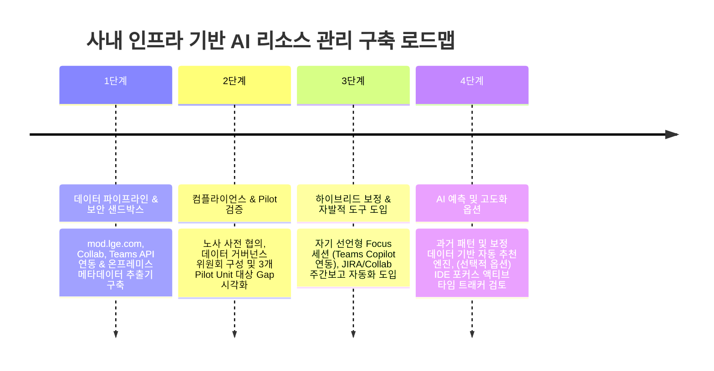

# AI 기반 인적 자원 및 프로젝트 리소스 관리 방안 (사내 인프라 맞춤형)

본 문서는 회사의 구체적인 도구 체계(**Confluence/Collab, mod.lge.com GitLab, Gerrit, MS Teams, Microsoft Copilot**)를 기반으로 구성원들의 업무 리소스(Resource)를 AI 기술로 체계적으로 관리하기 위한 실행 방안, 데이터 수집 전략, 추정 방법론의 한계 극복, 법적/보안 컴플라이언스, 계획 대 실제(Plan vs. Actual) 간극 분석 및 효율성 측정 프레임워크를 정의합니다.

---

## 1. 개요 및 추진 목적

현대적인 프로젝트 환경에서는 "누가, 어떤 프로젝트와 POC에, 얼마나 많은 시간과 노력을 투입하고 있는가"를 정확히 파악하는 것이 리소스 관리의 핵심입니다.

### 주요 목적
1. **숨겨진 업무의 가시화 (Invisible Work Visibility)**: 정식 프로젝트 외에도 Unit(팀) 단위로 `mod.lge.com`에서 진행되는 POC, Pre-Gerrit 작업, `Collab` 문서 작성 등의 실질적 공수를 자동 수집하여 가시화.
2. **계획 대비 실제(Plan vs. Actual) 간극 분석**: 사전 인원 배정 계획과 실제 투입 리소스 간의 오차를 측정하고 원인 분석.
3. **사내 표준 AI (Microsoft Copilot) 기반 리포팅**: MS Teams 및 Copilot 생태계와 연동하여 자연어 질의응답 및 주간 알림 인터페이스 구축.
4. **보안 및 법적 컴플라이언스 준수**: 소스코드 유출 방지(온프레미스 메타데이터 샌드박스) 및 개인정보보호법/근로기준법 가이드라인 완벽 수용.

---

## 2. 사내 도구 기반 데이터 수집 전략 (Data Collection Strategy)

### 2.1 도구별 수집 항목 및 연동 방식

수집은 구성원의 수동 입력 부담을 없애기 위해 **API/Webhook 기반 백그라운드 자동 수집**을 원칙으로 합니다.

| 수집 대상 도구 | 주요 역할 및 수집 대상 데이터 | 수집 항목 예시 | 수집 연동 방식 |
| :--- | :--- | :--- | :--- |
| **mod.lge.com (GitLab)** | Unit(팀)별 소스 관리, POC 작업, Pre-Gerrit 수정한 코드 | Commit 수, MR(Merge Request) 상태, POC 브랜치 작업량, 코드 수정 규모 | GitLab Webhook & REST API |
| **Gerrit** | 공식 코드 리뷰 및 최종 서브밋 시스템 | Gerrit Change-Id 이력, 코드 리뷰 소요 시간, Patch-set 제출 빈도 | Gerrit REST API / Event Stream |
| **Collab (Confluence)** | 기획서, 기술 스펙, POC 보고서, 지식 공유 문서 | 문서 작성/수정 이력, 페이지 뷰/댓글 협업, 기술 위키 업데이트 | Confluence REST API |
| **MS Teams** | 사내 기본 커뮤니케이션 & 회의 | 팀 채널/스레드 메시지 빈도, Teams 캘린더 미팅 시간 (개인 DM 제외) | Microsoft Graph API |
| **계획 시스템 (ERP/JIRA)** | 프로젝트별 사전 리소스 배정 계획 | 인원별/프로젝트별 할당 비율 (Planned Allocation %) | DB 연동 / REST API |

---

### 2.2 수집 데이터의 수준 및 세부도 (Granularity & Scope)

* **수집 대상 (정당한 범위)**:
  * **작업 단위 (Task/POC/Issue)**: `mod.lge.com` 저장소 및 `Collab` 문서 페이지 기반 프로젝트/기능/POC 분류.
  * **업무 성격**: 신규 개발, POC/R&D, Gerrit 코드 리뷰 대응, 문서화, 회의/지원 업무의 투입 비중.
  * **시간적 구획**: 일/주/월 단위의 프로젝트별 상대 활동 비중(%) 및 작업 패턴.
* **수집 제외 (Anti-Pattern)**:
  * 키보드 타수, 마우스 이동, 화면 스크린샷 등 마이크로매니징 데이터.
  * Teams의 사적인 1:1 대화(DM) 및 개인 비공개 메일 내용.

---

### 2.3 법적/개인정보 컴플라이언스, 거버넌스 및 데이터 파기 절차

본 시스템은 국내 **개인정보보호법** 및 **근로기준법상 '근로자 개인정보/업무 데이터 처리'**에 해당할 수 있으므로 법적 리스크 방어와 신뢰 확보를 위해 아래 정책을 명시합니다.

1. **노사협의회 및 직원 대표 사전 협의**: 시스템 도입 목적, 수집 항목, 활용 범위를 투명하게 공유하고 사전에 동의/협의 절차 거침.
2. **수집 목적 및 항목의 명확한 고지 (Privacy Notice)**:
   * 목적: 리소스 배정 보정, 병목 제거, 업무 환경 개선 (인사 평가 절대 활용 불가 명시).
   * 개인정보 수집 동의서 체결 (수집 항목, 보유 기간, 파기 절차 포함).
3. **거버넌스 체계 및 이의제기(Challenge/Feedback) 절차**:
   * **운영 주체**: R&D 기획, IT 보안, HR 담당자로 구성된 **'리소스 데이터 거버넌스 위원회'**가 전사 데이터 정책 수립 및 운영.
   * **데이터 이의제기 및 보정(Data Challenge)**: 개인이 "내 작업이 잘못 분류되었거나 비중 오차가 발생했다"고 판단할 경우, Teams Copilot 챗봇 또는 웹 대시보드 내 **'분류 이의제기(Challenge)' 버튼**을 통해 클릭 한 번으로 수정 요청 제출 가능.
4. **구체적 데이터 보존 기간 및 파기 정책 (Retention & Disposal)**:
   * **비식별 원본 상세 로그 (Raw Event Logs)**: 수집 후 **최대 6개월** 보관 후 완전 자동 파기 (DB 암호화 삭제).
   * **월별/분기별 집계 통계 데이터 (Aggregated Statistics)**: 리소스 추세 및 예측 모델 학습을 위해 **최대 2년** 보관 후 파기.
5. **단계적 시범(Pilot) 도입 및 Opt-In/Opt-Out 권한**:
   * 전사 확대 전 동의한 파일럿 Unit(팀)을 대상으로 3~6개월간 우선 검증.
   * 부득이한 특수 업무 수행 시 수집 대상에서 특정 기한 동안 제외를 요청할 수 있는 신청 절차 마련.

---

## 3. 시스템 아키텍처 및 추정 방법론의 한계 극복

### 3.1 전체 사내 파이프라인 및 메타데이터 샌드박스

소스코드 원본 유출 방지를 위해 **온프레미스 메타데이터 추출 레이어**와 **외부 Copilot 서비스 레이어**를 완벽히 격리합니다.

```mermaid
graph TD
    subgraph On-Premise Security Zone (사내 전용)
        A1[mod.lge.com / Gerrit]
        A2[Collab / Teams]
        
        B1[On-Premises Data Extractor]
        B2[Security Filter & Anonymizer<br/>*소스코드 본문 파기, 메타데이터만 추출*]
        B3[LLM Context & Multi-Signal Engine<br/>*세션 클러스터링 & 비중 추정*]
        B4[Human-in-the-Loop Review Queue<br/>*Confidence Score < 0.6*]
    end

    subgraph Cloud Service Zone
        C1[Metadata Sandbox DB<br/>*상대 활동 비중 % & 추정 지표만 저장*]
        C2[Microsoft Copilot & Graph API]
        C3[Teams Copilot Natural Language Interface]
    end

    A1 & A2 --> B1 --> B2 --> B3
    B3 -- "Score < 0.6 (상충/불명확)" --> B4
    B4 -- "본인/팀장 확정" --> C1
    B3 -- "Score >= 0.6 (자동확정)" --> C1
    C1 <--> C2 <--> C3
```

---

### 3.2 시간 추정의 방법론적 한계 및 From-To 근사 기법

#### 1) 근본적 한계의 인정 (Point-in-Time Events vs. Duration)
* `mod.lge.com` 커밋, Gerrit 서브밋, Collab 저장, Teams 메시지는 모두 **작업이 완료되거나 발생한 '시점(Point-in-Time, To)'** 데이터일 뿐, **'작업 시작 시점(From)'**이나 실질적 작업 몰입 시간을 직접 포함하지 않습니다.
* 따라서 본 시스템은 **"정밀한 절대 투입 시간(Man-Hours)"을 산출하는 것이 불가능함을 솔직히 인정**하며, 시스템이 제시하는 수치는 **'이벤트 신호 기반의 추정치(Estimates with Confidence Interval)'**이자 **'상대적 활동 분포(Relative Activity Distribution)'**임을 밝칩니다.

#### 2) From(시작 시점)을 근사하는 4가지 실무 기법

AI 엔진은 단일 시점 로그의 한계를 극복하기 위해 아래 4가지 기법을 결합하여 시작 시점을 추정합니다.

```
[활동 이벤트 A (10:00)] ---- (1.5h 연속 세션) ---- [활동 이벤트 B (11:30)] == (세션 인정)
[활동 이벤트 B (11:30)] ---- (4.0h 휴지 구간) ---- [활동 이벤트 C (15:30)] == (세션 분리 / 자정·회의)
```

1. **이벤트 간격(Inter-Event Gap) 휴리스틱 & 세션 클러스터링** (git-hours 방식)
   * 동일 사용자의 연속된 커밋/활동 로그 간격이 임계값(**예: 2시간 이내**)이면 하나의 '연속 작업 세션'으로 간주하여 합산.
   * 간격이 2시간을 초과하면 해당 세션을 종료하고 자정, 회의, 타 업무 전환으로 판단하여 끊음.
2. **JIRA/이슈 상태 전이 시간 (In Progress → Done)**
   * 이슈 트래커에서 작업 시작(`In Progress`)과 완료(`Done`) 버튼을 누른 시점을 추출하여 가장 명확한 From-To 쌍을 획득. (단, 상태 변경 지연 오차 감안)
3. **Teams Calendar의 역발상 회의 블록 (Inverse Calendar Block)**
   * Teams Calendar는 명확한 회의 시작/종료(From-To)를 제공함. 이를 역발상으로 활용하여 **"캘린더상 회의가 없는 2시간 이상의 연속된 비어있는 시간"**을 **'Potential Focus Time(몰입 가능 구간)'**으로 식별.
4. **Git Branch/PR 생애주기 (Branch Lifecycle Duration)**
   * `mod.lge.com`에서 새로운 feature 브랜치가 생성된 시점(From)부터 첫 커밋 및 Merge Request 승인 시점(To)까지의 전체 생애 기간을 태스크 수행 시간의 상한선(Upper Bound)으로 설정.

---

### 3.3 자기 선언형 하이브리드 보정 기법 (Self-Declared Hybrid Calibration)

단순 사후 추정 모델의 한계를 극복하고 데이터 신뢰성을 보장하기 위해, **'자발적 자기 선언형(Self-Report) 도구'를 도입하여 확보한 정확한 Ground-Truth 데이터로 전체 추정 로직을 보정(Calibrate)하는 하이브리드 접근법**을 채택합니다.

```
[자기 선언형 데이터 (Ground-Truth)]
     \
      +---> [오차 분석 및 보정 Engine] ---> [이벤트 간격 임계값(Threshold) 개인별 동적 최적화]
     /
[AI 사후 추정 모델 (Approximation)]
```

#### 1) 자기 선언형 Focus 세션 (Self-Declared Session)
* **Teams Copilot 인터페이스**: 팀원이 Teams Copilot에 간단한 대화 입력이나 버튼 토글(예: `/focus [프로젝트A]`, `/break`)을 통해 집중 작업의 시작과 종료를 자발적으로 마킹하게 합니다.
* **강력한 참여 유인책 (Incentive Design)**: 강제가 아닌 **'스스로에게 업무상 명확한 이득이 되는 비서'**로 포지셔닝합니다.
  * **JIRA Worklog 자동 입력**: 선언된 Focus 세션을 바탕으로 JIRA 티켓의 시간 기록(Worklog)을 AI가 자동 작성/입력해 줍니다.
  * **Collab 주간보고 초안 자동화**: 한 주간 축적된 Focus 세션 이력과 mod.lge.com 커밋 메타데이터를 LLM이 조합하여, 매주 금요일 퇴근 전 **'Collab 주간 업무보고서 초안'**을 자동으로 생성해 줍니다.
* **추정 임계값 보정 (Calibration)**: 자발적 Focus 세션(정확한 From-To) 데이터를 교정 데이터셋(Calibration Set)으로 활용하여, 3.2에서 정한 '이벤트 간격 임계값(예: 2시간)'을 개인의 실제 작업 스타일과 업무 성격에 맞춰 동적으로 보정/최적화합니다.

#### 2) 캘린더 사전 블로킹 & 사후 원클릭 검증
* **사전 블로킹**: 구성원이 Teams Calendar에 직접 집중 시간(예: '오후 2~4시: Project X 개발')을 미리 예약합니다.
* **사후 원클릭 검증**: 예약된 집중 시간이 종료되면, Teams Copilot이 조용히 카드를 발송하여 검증합니다.
  * *"예약된 시간에 계획대로 Project X에 집중하셨나요? [예] [아니오, 실제로는 Y 수행함]"*
  * 이를 통해 큰 업무 방해(마찰) 없이 높은 신뢰도의 정성/정량 데이터를 추가 확보합니다.

#### 3) 실시간 커뮤니케이션 사후 태깅 (Post-Communication Tagging)
* **매커니즘**: 사전에 예약되지 않은 즉흥적인 1:1 Teams 통화나 허들(Huddle)이 15분 이상 진행되고 종료되면, Teams Copilot이 원클릭 태깅을 유도합니다.
  * *"방금 OO님과의 18분 통화는 어떤 업무 관련이었나요? [프로젝트A] [POC_B] [기타/회의]"*

---

### 3.4 LLM Context & Tagging Engine 입출력 명세

JIRA 티켓 코드가 누락된 경우에도 다중 신호를 결합하여 LLM이 프로젝트 및 태스크를 추론하고 **상대 활동 비중 및 신뢰구간**을 산출합니다.

#### 1) 입출력 매핑 (Input/Output Interface)

```json
// [INPUT] 다중 정량/정성 신호
{
  "developer_id": "user_1234",
  "period": "2026-W29",
  "raw_events": {
    "gitlab_commits": 14,
    "gerrit_submits": 3,
    "collab_edits": 5,
    "teams_meeting_hours": 8.5
  },
  "context_signals": {
    "repository_name": "unit-mobile-poc-v2",
    "branch_name": "feature/camera-ai-tuning",
    "collab_active_pages": ["Camera AI Algorithm Tuning Spec"]
  }
}
```

$$\downarrow \text{LLM Multi-Signal Context & Session Calibration Engine}$$

```json
// [OUTPUT] 상대 비중 및 신뢰구간 중심의 추정 결과
{
  "developer_id": "user_1234",
  "project_distribution": [
    {
      "project_code": "PROJ-CAMERA-POC",
      "activity_ratio": "55%",
      "estimated_focus_hours": "22h ± 2h", // Calibration 적용으로 오차 범위 축소
      "confidence_score": 0.92
    },
    {
      "project_code": "PROJ-LEGACY-MAINT",
      "activity_ratio": "25%",
      "estimated_focus_hours": "10h ± 1.5h",
      "confidence_score": 0.88
    }
  ],
  "unplanned_meeting_ratio": "20%",
  "overall_confidence_level": "High (0.90)"
}
```

#### 2) 신호 상충 및 낮은 Confidence Score 처리 (Human-in-the-Loop)

* `confidence_score < 0.6` (신호 상충/불명확): 자동 확정을 보류하고 **'검토 필요(Needs Review)'** 큐로 전달.
* 작업자 본인에게 Teams 카드로 확인 요청 송부 (*"이 작업들의 비중이 'Camera POC (55%)'가 맞나요? [예] [비중/프로젝트 수정]"*).

---

### 3.5 소스코드 민감정보 처리 및 보안 (Security & Data Residency)

* **소스코드 원본 유출 완전 차단 (Code Payload Destruction)**:
  * `mod.lge.com`과 `Gerrit`에서 수집하는 정보는 커밋 시각, 수정 파일 개수, 추가/삭제 라인 수, 파일 경로 등 메타데이터에 한정됩니다. 소스코드 본문은 추출 직후 폐기(Drop)됩니다.
* **Microsoft Copilot 데이터 레지던시 (Metadata Sandbox)**:
  * Copilot 서비스에는 비식별화된 메타데이터 통계 및 **상대 비중(%) 추정치**만 **정제되어** 전송되므로 보안 리스크를 원천 차단합니다.

---

## 4. 인원 관리를 위한 필요 정보 및 수집 방안

| 정보 항목 | 세부 내용 | 사내 도구 활용 AI 수집 방안 |
| :--- | :--- | :--- |
| **개인/Unit 스킬 맵 (Skill Matrix)** | 강점 기술, 경험한 도메인/모듈, POC 이력 | `mod.lge.com` 경로/파일명 분석 + `Collab` 작성 문서의 기술 태그를 LLM이 비식별화하여 스킬 맵 갱신 |
| **실질 가용성 (Net Capacity)** | 연차, 휴가, 필수 회사 행사 제외 작업 가능 시간 | MS Teams Calendar 및 HR 연동으로 가용 시간(Available Hours) 자동 산출 |
| **업무 로드 & 번아웃 지수** | 과도한 회의, 야간 커밋, 잦은 긴급 POC 요청 | Teams 회의 시간 비중 + `mod.lge.com` 야간/주말 커밋 이력 트렌드를 Copilot 알림으로 피드백 |
| **POC 및 R&D 성향** | 선행 기술 검증(POC) 선호 vs 본선 개발 선호 | 과거 `mod.lge.com` POC 수행 이력 및 `Collab` 기술 문서 생성 빈도 분석 |

---

## 5. 계획(Plan) vs 실제(Actual) 간극 분석 (Gap Analysis)

회사에서 미리 세운 **프로젝트별 인원 투입 계획(Planned Allocation %)**과 **실제 상대 활동 비중(Actual Activity Ratio %)** 사이의 간극(Gap)을 측정하는 프로세스입니다.

### 5.1 절대 시간 대신 '상대 활동 비중 (%)' 중심 비교

```
[ 사전 계획 (Plan)  : A 프로젝트 70% 배정 / B 프로젝트 30% 배정 ] 
                           VS
[ 실제 추정 (Actual): A 프로젝트 40% 활동 / B 프로젝트 40% / 기타 지원 20% ] 
-------------------------------------------------------------------------
  ---> 간극 (Gap) : A 프로젝트 -30%p (과소 투입) / 기타 지원 +20%p (지원 과다)
```

* **원인 1: POC 및 선행 검증 지연 (POC Overhead)**
  * AI 진단: `mod.lge.com` POC 저장소의 커밋 세션 및 `Collab` 보고서 수정 빈도가 정식 프로젝트 활동을 상회함.
* **원인 2: 미등록 지원 업무 발생 (Unplanned Support / Interruption)**
  * AI 진단: Teams 채널 메시지 증가 및 타 저장소 커밋 이력으로 인해 20%p의 공수 차출 포착.
* **원인 3: 초기 추정 오차 (Estimation Error)**
  * AI 진단: 과거 유사 모듈 개발 시의 활동 분포와 비교하여 초기 난이도 추정 오차로 확정.

---

## 6. 업무 효율성 측정 방안 및 주의사항

### 6.1 사내 인프라 맞춤형 업무 효율성 지표 (KPIs)

1. **Focus Time (연속 몰입 가능 구간 비중)**
   * Teams 회의와 메신저 방해 없이 2시간 이상 연속으로 확보된 캘린더 및 작업 세션의 비율. (자기 선언형 Focus 세션을 통한 검증 데이터 포함)
2. **Pre-Gerrit to Gerrit Transition Time**
   * `mod.lge.com`에서 POC/임시 작업 시작 후 정식 Gerrit 서브밋(Submit) 단계까지 도달하는 생애주기 소요 시간.
3. **Collab 지식 자산화율**
   * `mod.lge.com` 소스 코드 작업 대비 `Collab`에 문서 및 아키텍처 가이드로 재산출된 비중.
4. **리뷰 & 협업 응답 속도 (Teams & Gerrit Review Response Time)**
   * Gerrit 리뷰 요청이나 Teams 채널 질문에 대한 평균 응답 및 승인 소요 시간.

---

### 6.2 효율성 측정 시 필수 주의사항

1. **정밀한 절대 사실(Absolute Truth)로 오인 금지**
   * 본 시스템이 산출하는 투입 비중 및 시간은 **'이벤트 간격 및 자기 선언형 데이터가 융합된 하이브리드 추정치'**입니다. 관리자는 이 수치를 **100% 오차 없는 정밀한 측정값으로 간주하지 말아야 하며**, 상대적 경향성 파악 및 팀원의 업무 병목 제거 지원을 위한 참조 지표로만 활용해야 합니다.
2. **굿하트의 법칙 (Goodhart's Law) 방지**
   * 커밋 수, Gerrit 패치셋 수, Collab 페이지 수로 성과를 평가하면 의미 없는 커밋 분할이나 문서 양산 부작용 발생.
3. **Copilot 지원 중심(Support, Not Surveillance) 운용**
   * 목적은 감시가 아니며, 과도한 회의나 긴급 POC로 본 업무에 집중하지 못하는 인원의 **"Focus Time을 보호"**하는 지원 시스템으로 활용.
4. **인사 평가와의 분리**
   * 본 데이터는 리소스 배정 보정 및 업무 환경 개선 목적으로만 사용하고 인사 평가에 직접 대입하지 않도록 원칙 수립.

---

## 7. 단계별 구축 및 도입 로드맵



> [!NOTE]
> **IDE 액티브 타임 트래커 도입 보류 (4단계 선택적 옵션)**
> 어떤 프로젝트/저장소에 IDE 화면 포커스가 활성화되었는지 순수 시간만 집계하는 도구(예: WakaTime 류)는 기존 안티패턴인 '키보드/마우스 물리 감시'와 명확히 구분되나, 구성원들에게 감시로 오인받을 소지가 큽니다. 따라서 1~3단계 도입 범위에서는 완전히 제외하며, 시스템 신뢰가 안정적으로 확보된 이후 **4단계에서 개인별 선택적 참여(Opt-in) 고급 옵션**으로만 남겨두는 것을 권장합니다.

---

## 8. 결론

회사의 기존 인프라(**Confluence/Collab, mod.lge.com, Gerrit, MS Teams, Microsoft Copilot**)를 연결하되, 단일 시점 로그의 한계를 극복하기 위해 **자발적 자기 선언형(Self-Report) 인터페이스와 사후 추정 모델을 결합한 '하이브리드 보정 모델'**을 설계했습니다.

이 개선안을 통해 구성원에게는 **'JIRA 입력 및 주간보고 작성을 돕는 비서'**로서의 혜택을 제공하고, 회사에는 **지속해서 칼리브레이션되는 정밀한 리소스 인사이트**를 제공하는 지속 가능한 공생 시스템을 구축할 수 있습니다.
